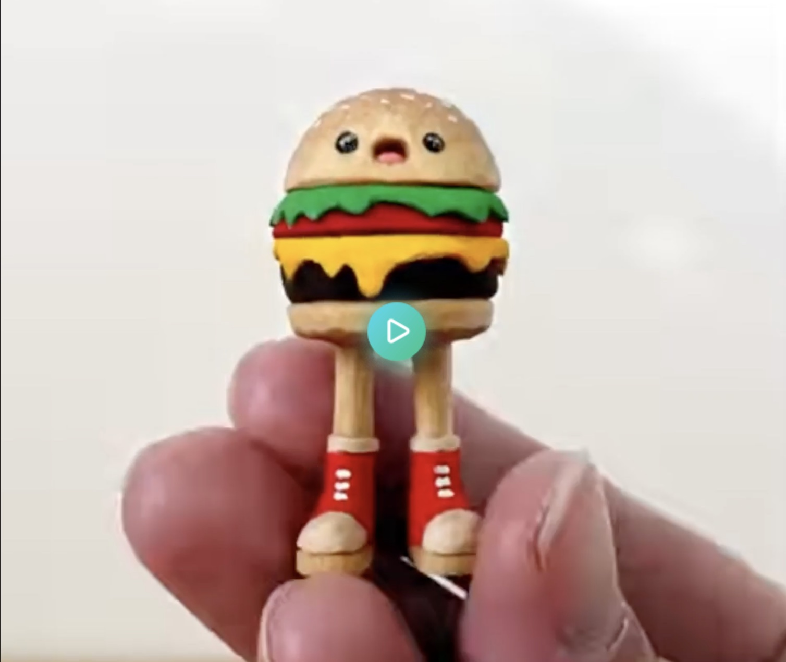
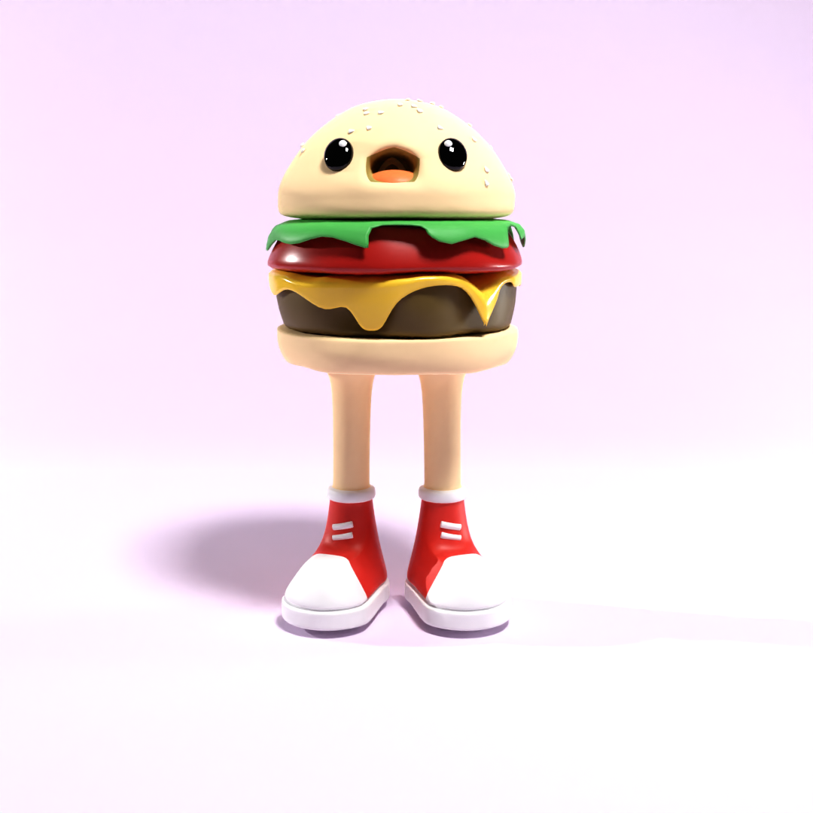

I came across this little GIF of someone carving a [little burger boy on imgur](https://imgur.com/t/woodworking/lyRmv5X).
As far as I can't, the poster of this GIF isn't the original carver.
Doing a quick google doesn't show any `burger boys` that are similar to this.
Hopefully I'm not stealing some beloved character.
It's just a thing I thought was cool.

Reference:

# First Attempt

The lighting is way too much and I need to add some texture onto the patty.
I also need to make his legs a little shorter.
The automatic weights on the armature didn't turn out quite right.
I also realized that he has a little zig zag pattern on the sides of his shoes.

I'd like to animate a little walk cycle where the burger bits sort of flop around, making an armature hard to do.
I'm still sort of a blender novice so I'm slowly learning.
This leans heavily on the sub surf modeling method, which gives me a soft appearance.

The bun at the top has seeds scattered as particles, with some weight painting to make them appear just towards the top.

# Second Attempt

TBC

# Question

You've made it this far. Do you think I should post the blender files for these?
I'm worried about the file sizes being too large for git.
The Burgerboy file is 25Mb for example (though a lot of that is the fact that I applied all the modifiers to a duplicate of all the pieces to see the effect).
If there are requests, I'll start doing that.
There's a link at the top to suggest changes (you'll need a github account).