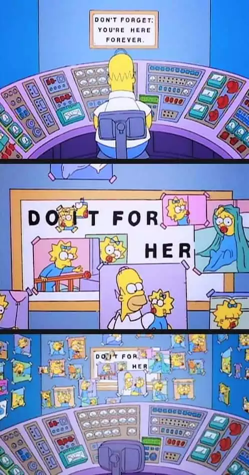
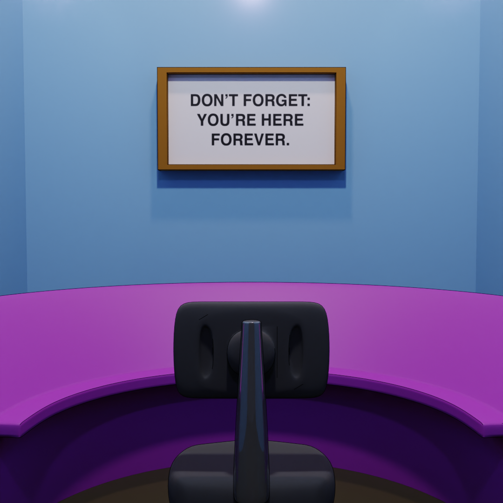

I love this scene in the simpsons:

# Starting out

I blocked out a simple console, chair, and photo frame just to see the overall look.

I think I'll need a different shader (perhaps a toon shader?) though I like the look of the subtle outline.
