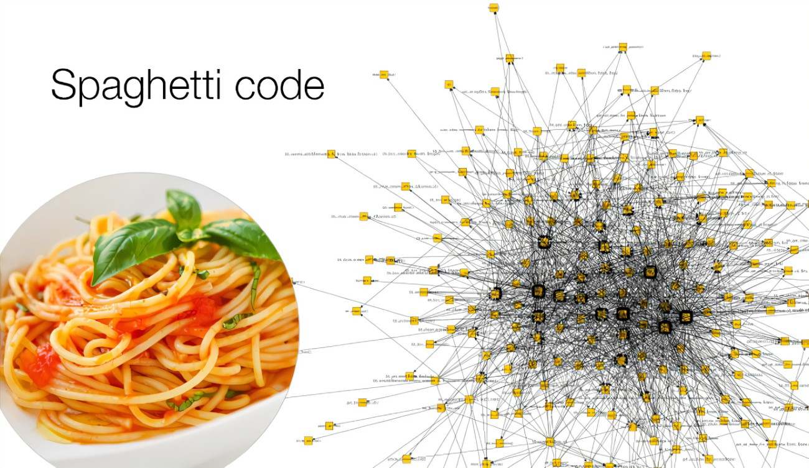

---
tags:
  - development
  - vuex
  - web
  - typescript
title: "Vuex Sync Part 1"
date: 2021-11-25T20:56:33-06:00
draft: false
cover:
    image: "Vuex.png"
---

This is the tale of how I wrote a state syncing framework based on vuex and [rollback netcode](https://en.wikipedia.org/wiki/Netcode).
It took a few years and isn't intended to be a "copy and paste" type of thing.
I'll be including code fragments and I'll eventually post a cleaned up repo with only the relevant pieces.
Who knows, if there's enough interest, maybe I'll even post a NPM package.

## TL;DR

This is a long article.
The short version is that I wrote a system that makes it easy to create rooms on an express.js server and have a finite state machine that is synced between all clients.
The client and the server can make auditable transformations to that state with enforced checks and some hidden state.
It's based on vuex and so far I think it works awesome.
As far as I can find on GitHub and Reddit, no one has done it before (at least in a satisfactory manor).
There's probably a good reason for it.

You would likely use a system like this if you were trying to keep shared state between a number of clients.
This can apply to things like a game of Jeopardy that runs on phones, a crossword app, etc.
Something where you want a significant portion of the state between clients to overlap and to have multiple sources of change.
## The Problem

First a tangent. A few years ago, I started on a project known as PadGames.


The idea was to take the things I liked about [Jackbox games](https://www.jackboxgames.com/?utm_source=matthewcdev) and incorporate them in a format that they could be played from anywhere.
If you've never played Jackbox games, the idea is that there's a laptop or desktop that serves as a "game board" of sorts and you have your phone as a client that connects as acts as a controller.
You can draw, type in answers, etc. Anything that isn't too latency sensitive generally works well.
Syncing state is a difficult problem and even Jackbox struggles with this.
My parents have often had a broken game state, refreshed their browser, and discovered that they've been kicked out of the game and cannot join back in

In the earliest versions of PadGames, I had simpler games such as a stock market where you could buy and sell stocks.
The goal was to make the most money and prices went up and down based on what people bought and sold in the previous turn.
It was largely a teaching tool for some local youth, getting them somewhat similar with the idea of the market as well as being fun.
The game ran on express, vue, and socket.io.
Even thought the server and the client shared a codebase, there being a tedious serialization and de-serialization layer that I had to write two or three times.
Personally, the experience was painful and I eventually quit the project since the code just became spaghetti so fast and it was getting harder and harder to track down state bugs as every game was slightly different.



Later, I worked with Luke on [netgames.io](https://netgames.io/about).
(I say worked on, but it was more of a helped out with since he started the project and did the hard work of creating a fantastic framework).
His work is closed-source, so I won't delve too much into how it worked but the point was that it provided a clean abstraction layer that you could put UI and game logic on top of.


To make a long story short, I wanted to create some new teaching resources for some volunteering work and wasn't entirely satisfied with what was out there.
Something jackbox games like but related to the material we were covering that day.
Making my own games seemed like a good solution and I had done it a few times before.
But syncing state was still an issue.

So the problem is this: create a way for the server and the clients to share a state machine, have it sync without any code on my part. 
It must be robust and resilient against network interruption and latency in a multi-peer environment.
Additionally, it must handle users connecting and reconnecting.

## The Initial Attempt

I poked around the web trying to find something similar to this.
I wasn't able to find anything that quite worked or was even that similar.
It needed to be fast and low-latency with low latency, so a meteor like pub-sub system seemed like it wouldn't work as well as I hoped (the latency seemed too high, but perhaps it has gotten better over time).

The first attempt at this was to create a simple class that the client and server shared.
Basically, it had a state object internally and methods for modifying that state that could be listened to.
The approach worked at first, but reactivity was tough.
I think this approach could have worked, if I had hooked it in a more focused way and added ways to provide reactivity.
In the future, I might revisit this approach.

## Second Try

The solution was to use vuex on the client and the server.
Thanks to Vue v3 composition API, it is way easier to run Vuex (sort of) on the server.
In my testing on my laptop, a single express instance could handle 50,000 Vuex stores (though that stress test isn't with all the clients connected, just by making toggling state).
So by creating a vuex store with specific format, it could easily be synced.


There are a few rules for writing a store:

- All mutations must be deterministic, actions can be random.
- Actions on the client side will be transmitted to the server
- Actions must have the source of the action included in the payload, it is replaced by the server when the request comes in, so the actual client sends null
- Mutations on the server as synced, any mutation with Server in the name is not synced
- All synced stores must implement a method known as `setState` which accepts the state of the object and sets the state using vuex methods so reactivity is preserved
- All synced stores must implement a getter that returns the hash of the current state (minus the server side information).

All this boiled down to three basic pieces: client plugin, the server vuex, and the store itself.

### The Client Plugin

There are a few steps to the client plugin:

1. Create websocket
2. Connect the websocket's defined events to the plugin and some admin things
3. Setup reconnect events to request a sync

The plugin itself also implements something akin to rollback netcode.

#### Step 1-2: Creating the websocket

In my main store which keeps track of login, the jwt cookie, the current game selected, and our user information, we have an action called `getLogin`.
I'm using `vuex-smart-module` to define my vuex stores, since it's just so fantastic. 
But you're welcome to adapt the ideas to whatever method you're using.
The `getLogin` method runs when the store is initialized.

```typescript
import { io, Socket } from "socket.io-client";
import { Store } from "vuex";
// Globals
type WebSocket = Socket<DefaultEventsMap, DefaultEventsMap>;
let SOCKET: null | WebSocket = null;
// ... truncated ...
class MainStoreActions extends Actions<
    MainStoreState,
    MainStoreGetters,
    MainStoreMutations,
    MainStoreActions
> {
  // Called after the module is initialized
  $init(store: Store<any>): void {
    this.actions.checkLogin();
  }
  checkLogin() {
    const state = this.state;
    if (state.loggedIn) return;
    // ... JWT parsing code truncated ...
    // Connect
    if (state.loggedIn && SOCKET == null) {
        SOCKET = io({
            auth: {
                token: this.state.jwtCookie,
            }
        });
        const self = this;
        SOCKET.on(SocketEvents.SET_GAME, (item: unknown) => {
            if (typeof (item) != "string") return;
            const game = item;
            if (game == '' && self.state.currentGame != '') {
                console.log("refreshing the page to clear state", game, self.state.currentGame);
                window.location.reload();
            }
            self.mutations.setGame(game);
        });
        SOCKET.on(SocketEvents.SERVER_MUTATION, (items: any) => {
            self.mutations.server_mutation(items);
        });
        SOCKET.on('reconnect', ()=>{
            self.actions.requestGameSync();
        })
    }
  }
  async requestGameSync() {
      this.actions.emit(SocketEvents.GAME_SYNC);
  }

  async emit(message: string | [string, any]) {
      if (SOCKET == null) {
          console.error("Socket isn't initialized, dropping message", message);
          return;
      }
      if (typeof(message) == 'string') {
          SOCKET.emit(message);
          return;
      }
      const [type, items] = message;
      SOCKET.emit(type, items);
  }
}
```

There are three important things here, we listen for a `SET_GAME` event from the server, which reloads the page if we already had a game set. We also issue a special mutation called `setGame` which is leveraged later.
We listen to an event called `SERVER_MUTATION` and then confusingly we issue a new mutation called `server_mutation`, this will make sense.
Lastly, we tell it to request a resync packet when we reconnect. By default, the server doesn't listen to reconnects and just responds to reconnect packages as needed. This might be revised in the future.

Requesting a game sync packet is just emitting the `GAME_SYNC` packet.
Emitting is an action that leverages the socket.

Next we look at the mutations, setGame isn't anything special, we just set the local state.
`server_mutation` is strange as it doesn't do anything.

```typescript
class MainStoreMutations extends Mutations<MainStoreState> {
  setGame(game: string) {
      this.state.currentGame = game;ß
  }
  server_mutation(data: any) {
      // the plugin will grab this
      return true;
  }
}
```

We pass in some data to server_mutation, but don't use it.
The reason for this is that the plugin listens to that mutation.


If you're not familiar with the basics of vuex, I'd recommend [brushing up](https://vuex.vuejs.org/#what-is-a-state-management-pattern).
The short version is that there are four parts to a vuex module (as of time of writing): state, getters, mutations, and actions.
State is the actual state of the store, which is reactive. It is readonly and can only be modified by mutations.
Getters are a way to map the state to different forms in a reactive way.
Mutations are methods that accept arguments and perform transformations to the state.
Actions are like mutations, but they cannot directly modify the state. Additionally, they can be async so you often put http calls in here.

#### Step 3: Onto the plugin itself

I've broken it up into three sections.

```typescript
import { ActionExtraPayload, ActionPacket, ActionPayload, ActionSource, isActionExtraPayload, isActionSource, MutationPacket, SocketEvents } from "../../common/types";
import { Store } from "vuex";
import _ from "lodash";

// Mutation packet looks like this
/*
interface  {
  type: string;
  payload: any;
  resultHash: number;
}
*/

const serverMutationChain:MutationPacket[] = [];
const localMutationChain:MutationPacket[] = [];
let resync_requested = false;

export default function clientSideSocketPlugin(store: Store<any>) {
    store.subscribe(mutation => {
       // ... mutations are tracked here ...
    })
    store.subscribeAction({
        // ... actions tracked here ...
    }, { prepend: true });
}
```

I'll put a huge disclaimer here that this is not polished code, this is code pumped out at 9pm in a after-work coding frenzy.
The kind of frenzy you get when you see progress being made and you keep pushing to extract whatever you can.

So you can see we subscribe to mutations and actions.
Additionally, we keep track of two "chains": the local and the server.
The local chain is all the mutations that have occurred on the client and server is all the mutations that we've received from the server.
These chains are reset when we set the game mode or receive a `setState` packet from the server as we now have a known state to start from.

Let's see how the we listen to mutations.

```typescript
import { ActionExtraPayload, ActionPacket, ActionPayload, ActionSource, isActionExtraPayload, isActionSource, MutationPacket, SocketEvents } from "../../common/types";
import { Store } from "vuex";
import _ from "lodash";

const serverMutationChain:MutationPacket[] = [];
const localMutationChain:MutationPacket[] = [];
let resync_requested = false;

export default function clientSideSocketPlugin(store: Store<any>) {
    store.subscribe(mutation => {
        if (mutation.type == 'setGame') {
            // Clear our chains when the game resets
            console.log("Clearing mutation chains because game reset");
            if (serverMutationChain.length == 0 && localMutationChain.length == 0) return;
            const gameName = mutation.payload;
            if (gameName != '') store.commit(gameName+"/setState");
            serverMutationChain.splice(0, serverMutationChain.length);
            localMutationChain.splice(0, localMutationChain.length);
            return;
        }
        const currentGame = store.getters.currentGame as string;
        if (currentGame == null || currentGame.length == 0) return;
        // We know we have a game
        if (mutation.type == 'server_mutation') {
            const packet = mutation.payload as MutationPacket;
            if (packet.type.endsWith("setState")) {
                console.log("Special set state packet");
                // reset both sets of mutation chains
                resync_requested = false;
                serverMutationChain.splice(0, serverMutationChain.length);
                localMutationChain.splice(0, localMutationChain.length);
            }
            serverMutationChain.push(packet);
            // Step 1: Check if we need to apply this packet, look in our local mutation chain to see if we've already done it
            let shouldApply = false;
            let outOfSync = false;
            console.log("Got server packet "+packet.type, serverMutationChain, localMutationChain);
            if (serverMutationChain.length > localMutationChain.length) shouldApply = true;
            if (!shouldApply) {
                // Scan ahead to see if we've already done this exact commit?
                const hash = store.getters[currentGame+'/stateHash'];
                console.log("Scan ahead to see if we've already applied this packet",hash,packet.resultHash);
                outOfSync = hash != packet.resultHash;

            }
            if (!outOfSync && shouldApply){
                console.log("server mutation", mutation, JSON.stringify(packet));
                store.commit(packet.type, packet.payload);
                // TODO: look at state hash afterwards
                const hash = store.getters[currentGame+'/stateHash'];
                console.log("StateHash", hash);
                if (hash != packet.resultHash) {
                    outOfSync = true;
                    console.error("Local hash = "+hash, packet.resultHash);
                }
            }
            if (outOfSync && serverMutationChain.length != 0 && serverMutationChain[0].type.endsWith("setState")) {
                console.log("Replaying server commits");
                localMutationChain.splice(0, serverMutationChain.length);
                serverMutationChain.forEach((x)=>{
                    store.commit(x.type, x.payload);
                });
                const current_hash = store.getters[currentGame+'/stateHash'];
                const last_hash = serverMutationChain[serverMutationChain.length - 1].resultHash;
                console.log("Replayed "+ current_hash+ " =?= "+last_hash);
                outOfSync = current_hash != last_hash;
            }
            if (outOfSync && !resync_requested) {
                // We're out of sync, request a reset
                resync_requested = true;
                console.error("We've becoming desynced");
                store.dispatch('requestGameSync');
            }
        }
        else if (mutation.type.startsWith(currentGame)){
            const hash = store.getters[currentGame+'/stateHash'];
            // we should log all other mutations
            const packet: MutationPacket = {
                resultHash: _.clone(hash),
                type: mutation.type,
                payload: _.clone(mutation.payload)
            };
            localMutationChain.push(packet);
            console.log("local mutation", packet, hash);
        }
    })
    store.subscribeAction({
        // ... actions tracked here ...
    }, { prepend: true });
}
```

So we listen to if we're doing a `setGame` mutation. If so, reset the chains and bail.
If we don't have a game currently set, we can also bail.
Then we check if this is a `server_mutation` mutation. Remember that from earlier? The wonky method that didn't do anything? Yeah- it's back baby.

Next we look at the mutation that the server wants us to apply.
If it's a `setState` packet, we can clear the chains and go ahead as normal.
We add the mutation to our server chain, then try to figure out if we need to apply the packet.
We do that by calculating the hash of the current state and looking at the hash that the server state is at.
*It's important that when we write our server hash function that we don't include server only data in our hash.*
We determine if we're out of sync from the server if our hashes don't match.
This is where rollback comes in, we start from the start of our chain (the first one should be a `setGame` packet), applying each packet we have from the server trying to make it all work and match.

If we have gotten to the end and we are still out of sync from the server, we request a resync packet.
This means the server sends a `setState` packet just to us so that we can clear our chains and get to work.
There needs to be some future work to add the client mutations ontop of what we have from the server, but currently the latency on the mutation occurring on the client and coming back from the server is under 200ms (not great, but enough that the likelihood of overlapping states are pretty low in most games).
This will likely get a much more comprehensive overhaul in the future.
Perhaps even with some unit tests?

Our games are [namespaced](https://vuex.vuejs.org/guide/modules.html#namespacing) into the main vuex module so any mutation that's occurring locally on the client will be prepended with the name of the game.
For example, one game is called `matchup` so a common mutation we see is `setPlayerButton` so the event type would be `matchup/setPlayerButton`. If we see any mutations to start with our current game, we log them to our local chain.

Onto listening for actions.

```typescript
import { ActionExtraPayload, ActionPacket, ActionPayload, ActionSource, isActionExtraPayload, isActionSource, MutationPacket, SocketEvents } from "../../common/types";
import { Store } from "vuex";
import _ from "lodash";

const serverMutationChain:MutationPacket[] = [];
const localMutationChain:MutationPacket[] = [];
let resync_requested = false;

export default function clientSideSocketPlugin(store: Store<any>) {
    store.subscribe(mutation => {
        // ... mutations are tracked here ...
    })
    store.subscribeAction({
        after: (action, state) => {
            if (action.type.indexOf("/") == -1) return;
            let tweaked_payload = _.cloneDeep(action.payload) as ActionPayload|null;
            if (isActionSource(tweaked_payload)) {
                tweaked_payload = null;
            }
            if (isActionExtraPayload(tweaked_payload)) {
                (tweaked_payload as any).source  = null;
            }
            // tell the server that we've done a thing
            const packet:ActionPacket = {
                payload: tweaked_payload,
                type: action.type
            }
            store.dispatch('emit', [SocketEvents.CLIENT_ACTION, packet]);
        }
    }, { prepend: true });
}
```

This is much simpler in comparison.
After an action has been completed, we check to make sure it was namespaced (look for `/`).
We have two types of payloads we can send to the server: `ActionSource` and `ActionExtraPayload`.
`ActionSource` looks like this
``` typescript
interface ActionSource {
  name: string,
  _id: number,
  socket_id: string,
  isAdmin: boolean,
}
```
`ActionExtraPayload` looks like this:
``` typescript
interface ActionExtraPayload {
  source: ActionSource,
}
```
So the payload is either the source itself, or it has a member called source.
Before we send it off to the server, we set these to null and then send it.
This is important as on the server, we detect which type it is, and fill it in with the information from the socket JWT auth header.

### Server side

Since this is already getting long, I'll cover the server side in part 2.
Since normal vuex doesn't run on the server, I implemented a slimmed down version of it that supports most of the same features.

### The Synced Store

I'll cover the store itself in part 3.
There's a common store that implements things like users being added and removed.
All other stores extend from that store.

## Where To Go From Here?

I'm cleaning up my specific use private GitHub repo and publish a slimmed down version of this with a simple trivia game or maybe the stock market game I mentioned earlier.
I think I'll do that in part two, with some additional work working on improving the technique.

