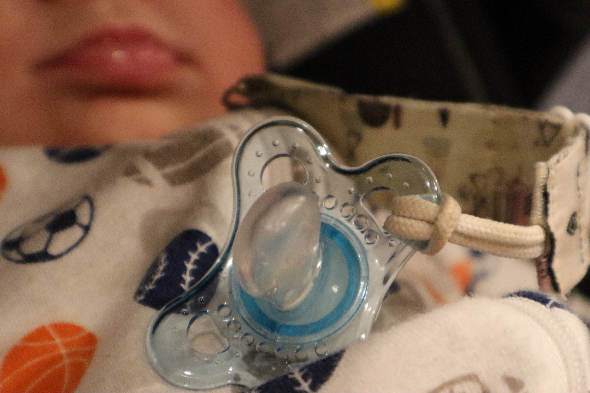

Surveys by [Common Sense Media](https://www.commonsensemedia.org/research/the-new-normal-parents-teens-and-devices-around-the-world) and the [Consumer Mobility Report](https://newsroom.bankofamerica.com/files/press_kit/additional/2017_BAC_Trends_in_Consumer_Mobility_Report.pdf) both state a large majority Americans sleep next to their phone or with their phone in hand. According to a [2019 Statista survey](https://www.statista.com/statistics/1005723/share-of-people-feeling-anxious-without-their-phones-in-us/), 44% of participants reported feeling some anxiety when separated from their phone (not the same thing as the [smartphone itself causing anxiety](https://pubmed.ncbi.nlm.nih.gov/34702436/)).

This isn't a public decrying of how we are hopelessly addicted to our phones. This is to take a look at what you are doing with your phone and be consciously aware of what you are getting from it. In many ways, a smartphone is an adult pacifier.

A [pacifier](https://en.wikipedia.org/wiki/Pacifier) is a little thing you stick in a baby's mouth to calm them. It soothes the need to suck, even though the baby doesn't need to eat. It is called a binky, wookie, dummy, soother, or dodie. It comes from as early as 1473, back when it was more of a teething toy which slowly evolved into a rag with food wrapped inside (often sugar, fat, or meat and occasionally soaked in brandy). In 1900, Christian Meinecke invented the modern version we see today with handle, mouth guard, and rubber nipple.

Smartphones in many ways provide the same function. Feeling uncomfortable in a social situation? Pull out the phone and text a friend not there to complain about how boring it is. The Journal of Consumer Research [published a study in 2020](https://academic.oup.com/jcr/article/47/2/237/5716332) to investigate this effect. Interestingly, the same activities were more comforting when done on a smartphone compared to a laptop. The study mentions the reassuring presence of the smartphone. In moments of stress, they found people tend to seek out their smartphone as a refuge or soothing mechanism. It provides dopamine, connection to friends we care about, and can easily drown out the thing we don't want to deal with at the moment.

Jane Halonen and Richard Passman [studied 48 one-year-olds put in a standardized playroom](https://www.sciencedirect.com/science/article/abs/pii/S0163638378800101?via%3Dihub). Sometimes they had their mother, their pacifier, or nothing familiar at all. The researchers then looked at how the babies played before starting distressful behaviors. They found that pacifiers allowed to baby to play longer than not having anything familiar, but not as long as their mother being nearby. To apply the analogy to the smartphone, having a soothing mechanism allows you to do things that you wouldn't do normally. Think back to the example of the party, are there parties you wouldn't go to without your smartphone? You know you have a fallback in your back pocket if things get awkward or no one you know is there. Perhaps your smartphone helps you to de-stress on the tube ride home from the office.

I am not a therapist by any stretch. But I believe we all have coping mechanisms and to some degree they work, otherwise we wouldn't have them. What is more important in my opinion, is to be aware of the mechanism so that you can evaluate it's benefits and costs. The last few weeks, I've been reading a book or watching a blender tutorial on my phone as I'm falling asleep. It started as just running out time in the day and having something I wanted to watch. It evolved into something to entertain myself while I became tired.

Previously I used to just lay down and I would fall asleep within 5 or 10 minutes. Wanting to get back to that, I started leaving my phone on the charger in the bathroom and found I felt somewhat lost and unsettled when just laying down. After just a few weeks, I was used to having some sort of thing to entertain myself as I fell asleep and it got me wondering. Not whether this was a good or bad thing, but rather was this a thing I wanted? Did I like the benefit it provided? Was I okay with the costs?

Ultimately, I decided that the iPhone was too interesting to fall asleep effectively but I liked reading (if I'm reading a boring book), so I'm going to get a kindle and keep up the habit of reading while falling asleep. It's an interesting way to think about our phones and our relationship with them.

[Photo by <a href="https://unsplash.com/@charlesdeluvio?utm_source=unsplash&utm_medium=referral&utm_content=creditCopyText">charlesdeluvio</a> on <a href="https://unsplash.com/?utm_source=unsplash&utm_medium=referral&utm_content=creditCopyText">Unsplash</a>]
[Photo by <a href="https://unsplash.com/@sweetb_photography?utm_source=unsplash&utm_medium=referral&utm_content=creditCopyText">Zeesy Grossbaum</a> on <a href="https://unsplash.com/s/photos/pacifier?utm_source=unsplash&utm_medium=referral&utm_content=creditCopyText">Unsplash</a>]
Photo by <a href="https://unsplash.com/@eddybllrd?utm_source=unsplash&utm_medium=referral&utm_content=creditCopyText">Eddy Billard</a> on <a href="https://unsplash.com/s/photos/smartphone?utm_source=unsplash&utm_medium=referral&utm_content=creditCopyText">Unsplash</a>
