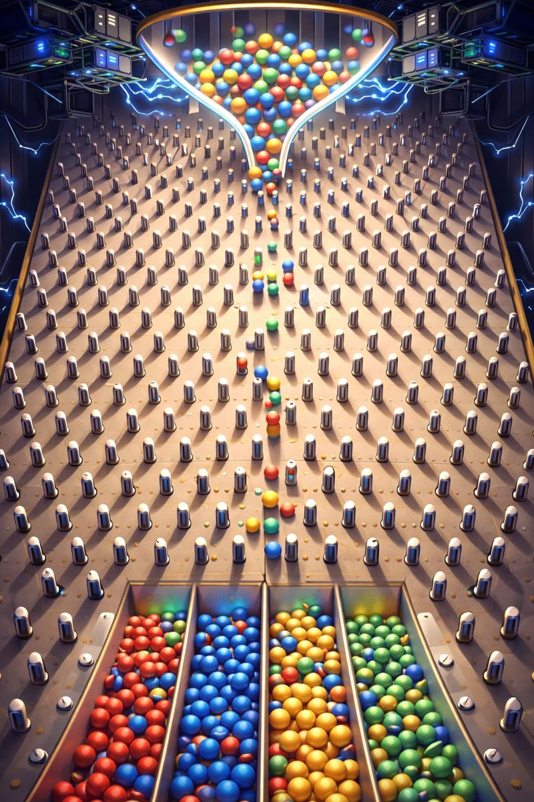

Like many coders, I participated in Advent of Code 2025.
However, this year I want to make it challenging.
Learning Rust or Elixir are both tempting options, but why not go for something a bit more out there?

I want to solve every problem with the GPU not the CPU.
Which means a compute shader.

I chose to use Swift and Metal as my shader language.
Mostly because I was using a Mac and partly because I've been meaning to improve my Swift skills as well.

The person who runs Advent of Code has asked not to repost or copy the actual content of Advent of Code (https://adventofcode.com/2025/about) and walking through each individual problem is rather boring for an article.

So let me talk about my general thoughts and the experience. 
Much of what I could say has been said in other blogs and the fantastic series of videos from Sebastian Lague (https://www.youtube.com/@SebastianLague/videos) where he uses compute shaders to explore various problems.

## The Code

The basic layout I copied from problem to problem was was:
1. The shader code
2. Compile the shader
3. Parse the input and create GPU buffers
4. Kick off the shader, parse the result
5. Compute a verification using the CPU to make sure it worked

This is the basic code in swift.

```swift
import Metal
import Foundation
let source = """
  kernel void compute_shader(device int8_t* inData  [[buffer(0)]],
                device int* constants  [[buffer(1)]],
                device atomic<uint>* results [[buffer(2)]],
                uint id [[thread_position_in_grid]]) {
    /* shader goes here */
  }

"""
guard let device = MTLCreateSystemDefaultDevice() else {
  fatalError("Metal is not supported on this device")
}
guard let commandQueue = device.makeCommandQueue() else {
  fatalError("Failed to create commandQueue")
}

let (inData, rowLength, startIndex) = readInFileAndGenerateData()

let count = inData.count
// Create the buffers that go into the GPU
let bufferA = device.makeBuffer(bytes: inData, length: MemoryLayout<Int8>.stride * count, options: [])!
let constants: [Int32] = [rowLength, Int32(count), Int32(startIndex)]
let bufferB = device.makeBuffer(bytes: constants, length: MemoryLayout<Int32>.stride * constants.count, options: [])!
var initialValue: [Int32] = Array(repeating: 0, count: count)
let bufferResult = device.makeBuffer(bytes: &initialValue, length: MemoryLayout<Int32>.stride * initialValue.count, options: [])!

// Create the shader library
let library = try! device.makeLibrary(source: source, options: nil)
// Find the function, doesn't matter what it is called as long as it matches
let function = library.makeFunction(name: "compute_shader")!

// Create a compute pipeline state
let pipelineState = try! device.makeComputePipelineState(function: function)

// Create a command buffer and encoder
let commandBuffer = commandQueue.makeCommandBuffer()!
let encoder = commandBuffer.makeComputeCommandEncoder()!

// Set the compute pipeline and buffers
encoder.setComputePipelineState(pipelineState)
encoder.setBuffer(bufferA, offset: 0, index: 0)
encoder.setBuffer(bufferB, offset: 0, index: 1)
encoder.setBuffer(bufferResult, offset: 0, index: 2)

// Calculate thread group size
let workers = count * 10
let threadGroupSize = MTLSize(width: min(pipelineState.maxTotalThreadsPerThreadgroup, workers), height: 1, depth: 1)
let threadGroups = MTLSize(width: (workers + threadGroupSize.width - 1) / threadGroupSize.width, height: 1, depth: 1)

// Dispatch the compute kernel
encoder.dispatchThreadgroups(threadGroups, threadsPerThreadgroup: threadGroupSize)
encoder.endEncoding()

// Commit and wait for completion
commandBuffer.commit()
commandBuffer.waitUntilCompleted()

// Read back the results
let resultPointer = bufferResult.contents().bindMemory(to: Int32.self, capacity: count)
let resultBuffer = UnsafeBufferPointer(start: resultPointer, count: count)

// Parse the resultBuffer and print it 
let actualResult = resultBuffer.filter({$0}) // Sometimes we allow small amounts of parsing
print("✅ Compute Shader completed successfully!")
print("Total accumulated value: \(actualResult)")
```

It is not the best swift.
I could have had xcode compile the shader for me and have a far better experience.
But I couldn't be bothered.

For once, the documentation was fairly solid.
I used these two resources: [the metal guide](https://developer.apple.com/documentation/metal)
and [the metal shading language spec](https://developer.apple.com/metal/Metal-Shading-Language-Specification.pdf)

Xcode was a miserable experience and yes I work for the company that makes Xcode (opinions are my own) and I do my best to avoid it.

ChatGPT also will fairly confidently provide incorrect information about metal shaders, I'm guessing it thinks it is valid in HLSL or other shader languages?


## Dumb Solutions

The GPU has a certain way of working.
It does not support recursion.
It can run massively parallel.
Managing state of the threads is ugly and requires atomics for correctly ordered operations.
Metal to my dismal does not support atomic operations on single bytes (uint8_t). It supports int/bool/long/float though long is not supported for every atomic operation.

One particular problem for 2025 involved a bunch of stacks of boxes on shelves in a grid.
How many stacks can be picked up (at least one side is free)?

On a CPU you would just step through each box and check the surrounding 4 boxes, accumulating some sort of count as you went.


On a GPU, why not compute every box at the same time?

Each GPU thread gets an index to help it compute differently from its cousins.
You could pass in the index of the box each thread is supposed to compute, then have the thread walk the grid until it finds the nth box.
But...
What if you just ran the thread on every cell in the grid?


Nvidia calls them warps, AMD calls them wavefronts, and for Apple Silicon they are threadgroups.

For the M1, Apple [claimed](https://en.wikipedia.org/wiki/Apple_M1?utm_source=chatgpt.com) that 24,576 threads could be run simultaneously.

So kicking off a 156x156 grid is totally reasonable.
If that grid position isn't a box, just return early.

Of course, each threadgroup runs the exact same instruction stream so when there is an if, the lane (a single thread) is marked as inactive until that particular if is finished.
It's one of the reason recursion isn't supported.

Anyway- running on an absolutely massive grid shows where the GPU shines.
My actual code had profiling it (which I removed for readability) and the GPU took 5ms almost every time.
The CPU could chunk through a small grid way in sub-millisecond times.
But as soon as you started to get to larger grids, the CPU ground to a halt and the GPU stayed at a consistent 5ms.

## Monte Carlo

Another one of the problems involves a plinko board like system.
The task is to assume an infinite number of balls falling down the plink board and calculate how many pegs were hit.



Every peg that can be hit, will be hit.

My first thought was to have a result buffer accumulating how many times each peg had been hit and the left or right path taken.
Send several thousand threads each starting at the top, walking through the path, atomically adding to the result.
They then just take the path that was less traveled.

This is a technique known as [Monte Carlo](https://en.wikipedia.org/wiki/Monte_Carlo_algorithm) used for rendering using a ray tracer as it is impractical to calculate every single path that a ray takes.
The basic idea is that by using slight amounts of randomization, you can get very close to the right answer.

However, that doesn't work well for week of code as you need the exact answer not just one or two off.
By massively increasing the number of threads, I could get the right answer on the smaller plinko board with just 8 layers.
But moving to the real input that had 50 layers meant the likely of a ray getting to a particular peg dropped _significantly_.

Instead what I did was borrow the approach from above and have a thread for every peg on the board.
It traversed up to see if it there was a peg on the left or right that a chip _could_ bounce off of.
Then it looked to see if that peg was marked as unknown, dead, or alive.
If it was unknown, the thread kept running until all the found pegs were dead or alive.
If any were alive, this peg got marked as alive.
If they were all dead, this peg got marked as dead.
If it ran into a peg (ie directly underneath a peg) without finding any other pegs, it would be dead.

## Graph Traversal

As Advent of Code went on, it quickly got to some problems that GPUs tend to struggle with.

One particular path gives you a directional graph with a start node and an end node, with no loops.
It then asks how many unique paths out are there?

There are many good articles and research papers out there about the topic, I particularly liked [this one](https://yzhwang.github.io/gpugraph.pdf) by Yangzihao Wang and John Owens.

A local stack for each thread allows it to iterate through nodes and add new nodes to explore.
However, figuring out what other threads have already looked at or computed becomes tricky.

In this case, I did a thread per node and calculated the number of unique paths from a given node to the end node.
This was calculated by adding up all the counts of its neighbors.

So it ended up looking similar to the plinko problem just not on a grid.
Most of the code ended up being creating the adjacency list (rather than a matrix which was inefficient since the graph was very sparse).

## Constraint Solvers

The problem that gave me the most trouble was a packing problem.
Given a grid of a certain size (5 by 10) for example, and a set of shapes (two 2x2 squares, 5 L shaped pieces, and 1 T shaped piece) can they fit in the required shape?

This is just begging to be a constraint solver problem, particularly after reading the [article by Jeremiah Crowell](https://jcrowell.net/posts/whole-year-sat) about something very similar.

This is an exact cover problem in that each item is included once.
So Algorithm X/[Dancing Links](https://en.wikipedia.org/wiki/Dancing_links) would work here.
As far as I know, there isn't an implementation of Dancing Links on the GPU.
I found the paper [GPU-accelerated Matrix Cover Algorithm for Multiple Patterning Layout Decomposition](https://arxiv.org/abs/2303.14335) which was sadly light on details.

There are some constraint solvers on GPU for example [Turbo](https://ptal.github.io/papers/talbot-leria-2025-slides.pdf) which is built on CUDA.

The approach I went with was that each thread explodes a different starting placement/shape/rotation and then uses a stack to try all the solutions it found.
With a 60x60 grid, 5 shapes, and 8 possible rotations (including mirroring), the number of starting points can reach 27k easily.
Once the thread finds a solution, it bails with success.

We just need one thread to report success, we don't care what the actual layout is.

Since the GPU doesn't do dynamic memory, there is a limit to the grid pre-built into the shader. 

## Debugging

The experience of debugging compute shaders is lackluster to say the least.
It's also interesting that when you have a bug in has real consequences on your computer as the display glitches.
Since the shader is compiled at runtime, you don't get warnings until you run (though having xcode compile it might have fixed that).
There are no printfs so I would often have a status buffer (one element per thread) for threads to write some sort of status into.
This made it easier to at least tell what the threads were doing.

## Conclusion

Working through Advent of Code on the GPU was unique.
It’s a completely different way of thinking about problems.
On the CPU, you can rely on recursion, flexible data structures, and sequential logic.
On the GPU, you’re forced to think in terms of massive parallelism, explicit memory management, and what happens when thousands of threads are doing exactly the same thing at the same time.
You quickly learn which problems are GPU-friendly and which ones are best left on the CPU.
Debugging was tedious, sometimes chaotic, and yes, occasionally my screen glitched.
Having to reason about atomics and data access was actually much easier than I expected.
If nothing else, it’s a fantastic exercise in mental flexibility.

In the end, I learned a lot about parallelism.
And honestly, that’s more rewarding than any single Advent of Code answer.

I'm already thinking about what else I can do on the GPU in a compute shader.
I've been thinking about making an SDF solver for ages (use a shader to calculate an SDF that best fits a mesh).
Let's see if I keep the compute shader train going in 2026.
