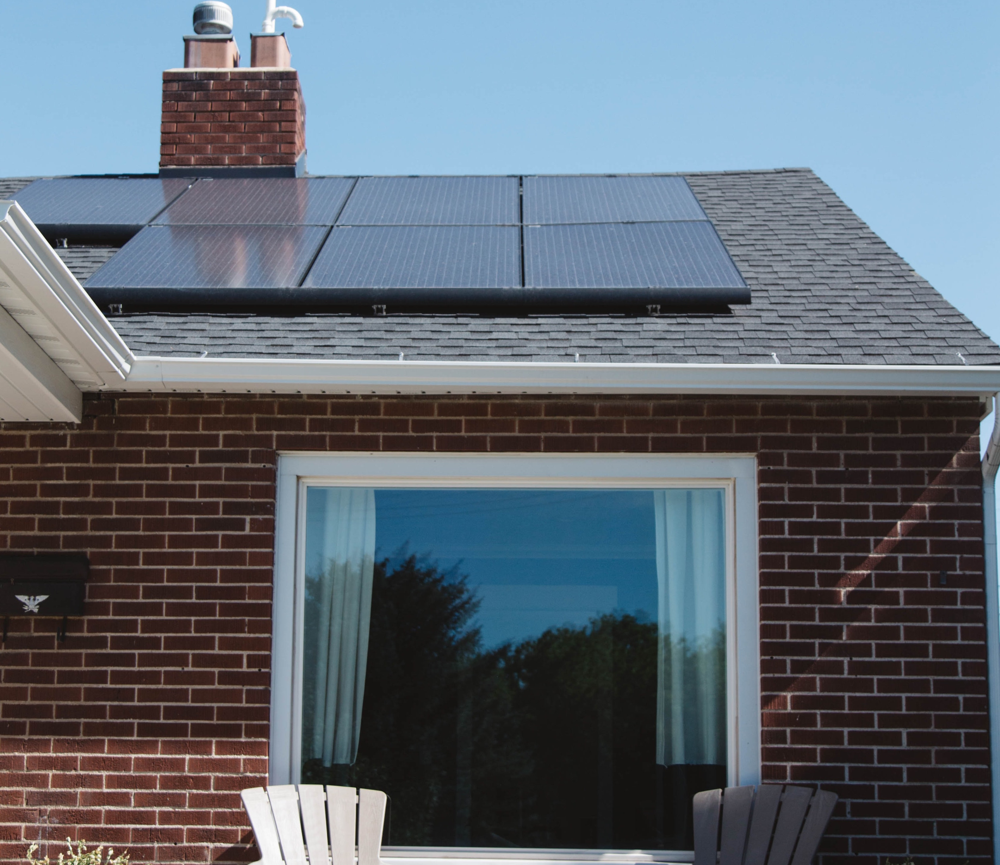

Let's get this out of the way at the start.

_This isn't about a house that can think for itself. But rather a house that can operate by itself._

When I was a kid, I went through a phase of wanting to be an architect.
My parents had some fancy architectural CAD software that I used to struggle with for hours.
Much like software, it was hard to understand how all these complex parts came together.
As a kid, it just looked like the sum of the parts was more than the whole.

I'm get older and homes and software are now just the product of surprisingly few people following some well-known patterns with some ingenuity thrown in.
I've been thinking about building my own home with a certain flair.
My wife and I have purchased and renovated two homes and we've been talking about what it would be like to start from scratch rather than make compromises based on what's already there.

This post attempts to look at the holistic inputs and outputs of a house and tries to evaluate how to design a house that is sufficient in all the metrics I can think of.

The categories broadly are:

- Electricity
- Water
- Heat
- Food
- Waste
- People

## Electricity

This is perhaps the most obvious of all the inputs and outputs of a home.
Electricity comes in from the grid and it doesn't generally flow out unless you have solar.
However, the input and output are far more tied together than most people think.
In most cases, solar is setup in a grid tie configuration in most cases.
This allows power to flow back into the grid as applicable, which can be handy if you have a net metering setup.
However, this means that your solar panels are tied to the grid, which means in the event of maintenance or some power outage, your power could flow back to the grid unimpeded. 
Solar equipment is designed to shut off in the event of power loss so that the utilities companies can power off lines fully and repair them.

You might be asking, why not just design the equipment to use your own power when the grid is down and intelligently switch over when not?
They sort of do but it's quite expensive.
Because to make your own power you need large inverters to provide the 50-60hz your appliances expect.
Normally your solar panels can sync with the grid's frequency and just rely on that.

Once you've already got big inverters, you might as well add batteries.

So in my mind, the ideal house would have 10ish KWH (kilowatt-hours) of power storage.
Whether this was through something like Tesla's powerwall system or a more DIY solution isn't as important.
The key is that the power comes through the battery and the grid charges the batteries.
Plenty of houses have it and it's not anything special.

## Water

Now we start getting into the non standard territory.
Water will increasingly become more complicated as there is less of the clean version.
We've got gobs of salty, dirty, and gray water all around us.
It's just the last 120ish years that we've gotten spoiled by pulling a knob and as much water as we wanted coming out unimpeded.
Water is not something we expect to get, it comes to us.

Obviously, there are those with septic systems (covered later in waste) or are far enough out that they have a well or rainwater system.
If your house is in a "normal" location, why go through the hassle of a a well or rainwater system?
The local utilities have you covered.

What about when they don't?
What about when there's a leak in the system and your wastewater treatment plant is getting 50% more water than it was designed to process and suddenly your water has unsafe levels of particles and bacteria in it.
What about lead in pipes or any other disaster that can interrupt the water supply?

The whole point of this thought experiment house is designing something that uses, but does not rely on common infrastructure.
So the easiest solution would be to first pump water in from the grid and store in, then push

## Heat

## Food

## Waste

## People
