*Editor's Note: This was originally [published on medium](https://medium.com/@matthewfcarlson/nintendo-64-architecture-and-history-8a01cf503a6a)*

It stands as a unique and marvelous console even by today’s standards. Both from an technical as well as cultural standpoint, it was simply stupendous. This article showcases the history of the Nintendo 64 as well as explores it from a technical standpoint. If you’re like me, you likely have fond memories of this console. If you’re interested in the technical bits, skip ahead to the architecture.

To set the stage, the N64 was first released in Japan in 1996. When you think of the 1990’s you may think of the pocket-sized Gameboy color with Pokémon Red and Blue. But in reality, the Gameboy color didn’t come out until 1998, _two years after_ the N64 came out.

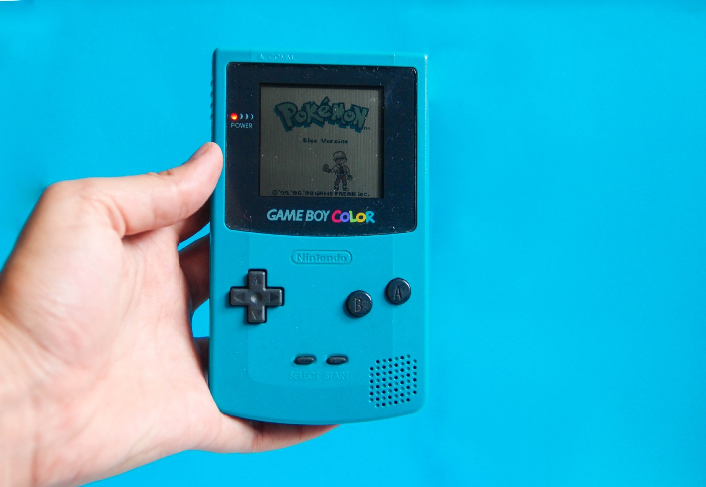Photo by [Denise Jans](https://unsplash.com/@dmjdenise?utm_source=medium&utm_medium=referral) on [Unsplash](https://unsplash.com?utm_source=medium&utm_medium=referral)

The Gameboy at the time was the impressively large and heavy, Gameboy. With a grayscale screen and loaded with 4 AA batteries, it was a brick of a gaming experience. The Gameboy pocket (a slightly smaller version of the successful gameboy) had come out in some markets, but didn’t see the same widespread availability as the original Gameboy.

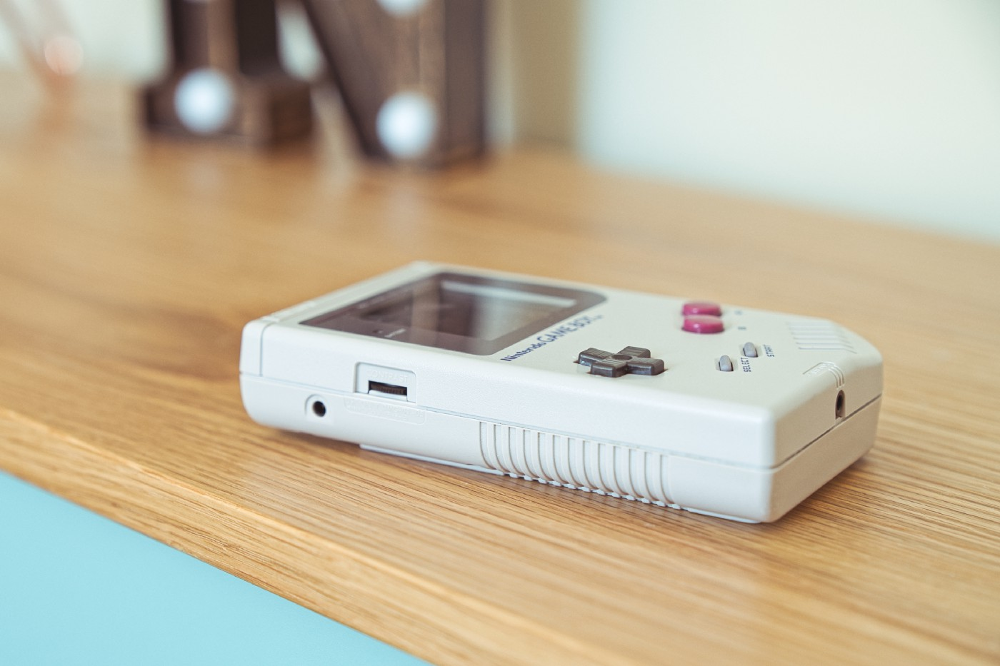Photo by [Dan Counsell](https://unsplash.com/@dancounsell?utm_source=medium&utm_medium=referral) on [Unsplash](https://unsplash.com?utm_source=medium&utm_medium=referral)

This is to illustrate the sheer craziness that the Nintendo 64 represented, particularly in the sub $300 price point. The idea of a 64 bit console with 3D graphics just under six years after the 16 bit SNES seems reasonable in hindsight but ludicrous at the time.

Let’s dive into the systems of itself. It has a few peculiarities. You’ve probably noticed the wonky shape of the controller(and likely if you’re reading this, you used it). It often felt that you needed three hands to really properly take advantage of the all the buttons.

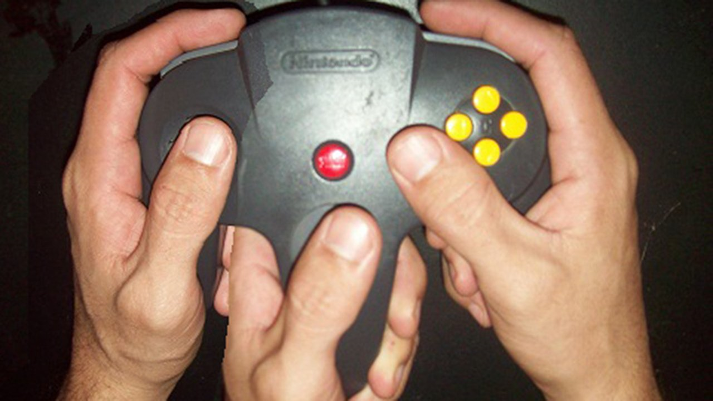

You’ll notice it has an analog stick. This was the first commercial video game with an analog stick as its primary input mechanism. The D-Pad had been the defacto standard for decades and Nintendo personally had a lot of good technology and experience with making 8-way D-Pads.

An amusing story from one LucasArts developer is that only certain members of the development team were allowed to know what the controller looked like. So they had to be kept in a card box box with holes cut in so you could reach inside and handle the controller. The common joke on the developer team is that the controller was a bowl of telepathic water you stuck your hand into, but of course, you had to think in Japanese.

In addition to the trident like shape, the control stick had on its face sharp, raised circular ridges that if played too hard, could leave marks on your thumb or palm. We’ll discuss the industrial design and reasoning behind the controller later once we start discussing the technical architecture of the console itself. Let’s talk about the history of Nintendo as it helps understand a lot of their decisions. This section will be pretty fast.

Nintendo was founded in 1889 as a Hanafuda (花札) manufacture. Hanafuda are a type of playing card. After Japan closed all contact with the western world in 1633, the Government outlawed the playing cards that had been introduced by the Portuguese in the mid 16th century. It was a 48 card deck with four suites and looked fairly similar to the 52 card deck we have today. In response to the ban, cards became disguised, often with flowers.

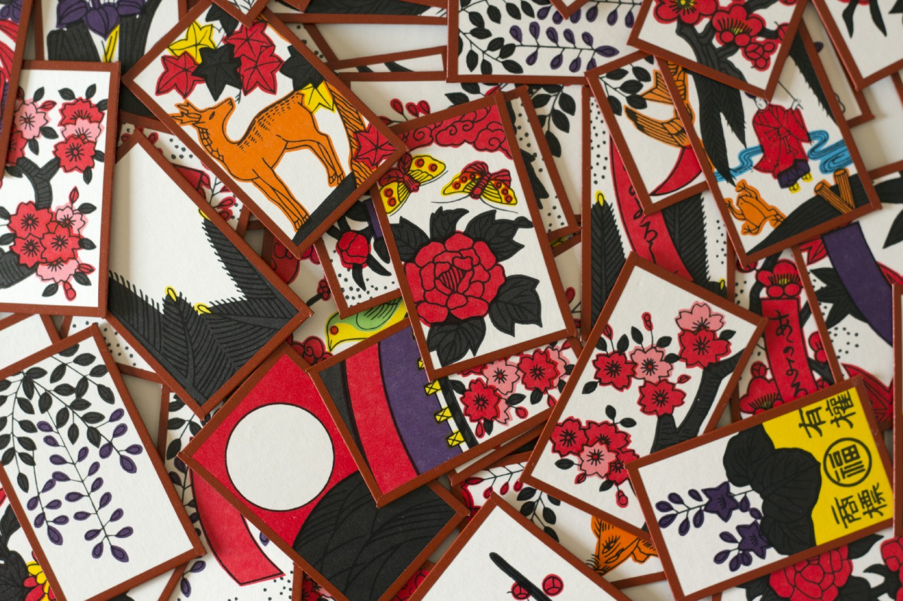Creative Commons from [Japanexperterna.se](https://commons.wikimedia.org/wiki/User:Japanexperterna.se)

As the Government caught on, they began to outlaw the new forms of the playing cards. Card manufactures responded by further obfuscating the cards, become more and more elaborate as time went on. In fact, to this date, Nintendo still manufactures Hanafuda cards themed with various video game IP that they own. The point of this introduction is that Nintendo has a history of being an underdog, taking their time, and being very protective/secretive about what they do.

The turning point for Nintendo came in 1956 when they visited the USA. The world’s largest manufacture of playing cards at the time was headquartered there. The current CEO (Yamauchi) was dismayed to find the largest company in their industry headquartered in a small dingy office above a corner store. When your largest competitor in your established industry is in a tiny office, it is a good wakeup call that it might be time to expand to other markets.

Between 1963 and 1968, they experimented. Taxi’s, hotels, instant noodles, and vacuum cleaners were among some of the products they tried. However, despite their efforts they found they were only good at making toys. The 1964 Olympics were in Tokyo, provided a much needed economic boom. The market for toys was tight, competitive, and low margin. Electronic toys had higher margins and less competition. Nintendo had a habit of hiring talented electrical engineers to run their assembly and production lines and those engineers had a habit of creating creative solutions for problems on the line.

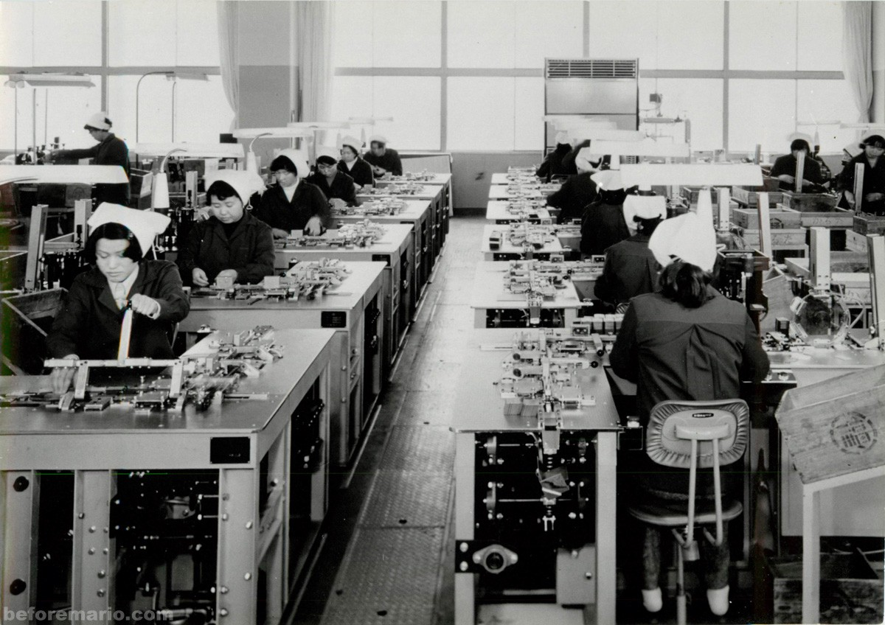Source: [http://blog.beforemario.com/](http://blog.beforemario.com/) taken late 1960’s of the Nintendo factory

One particular engineer designed an robotic arm as a sort of plaything. It was a clever design that made use of what was on hand. [Hiroshi Yamauchi](https://en.wikipedia.org/wiki/Hiroshi_Yamauchi), the CEO of Nintendo, came through the factory in 1966 and saw the toy for what it was. They asked him to design it in full, which became the Ultra Hand and was a huge success. The engineer, [Gunpei Yokoi](https://en.wikipedia.org/wiki/Gunpei_Yokoi), went on to design the Game & Watch Series and supervise Donkey Kong, Mario Bros, Metroid, the Virtual Boy, among others. It was Yokoi who said:

> “The Nintendo way of adapting technology is not to look for the state of the art but to utilize mature technology that can be mass-produced cheaply.”

Another one of their their first real hits was the Nintendo Beam Gun, a duck hunt like game. Keep in mind, Pong wasn’t even on the market yet. Nintendo bought up old bowling lanes and made indoor shooting galleries with their light guns. This proved to be expensive to maintain as it required space and staff so they decided to focus on home consoles and arcades rather than running their own spaces. The popular Mr. Game & Watch was released in 1981.

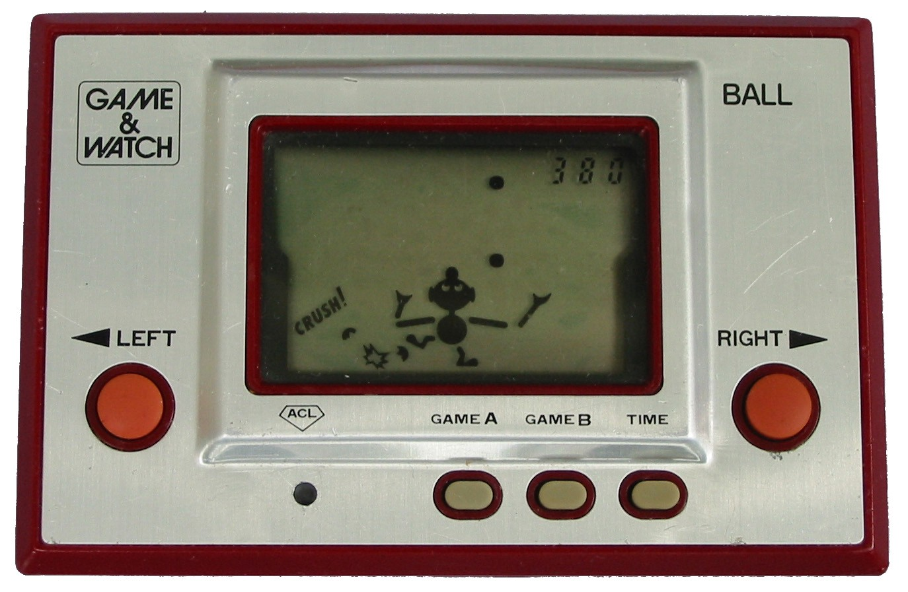

The video game market in the USA crashed in 1983. While the exact cause is somewhat of a mystery, Nintendo largely credited it to a proliferation of sub-par quality games that eroded consumer trust. Negotiations with Atari to redistribute their home console, the Famicon (or the NES as it would later be known) had fallen apart, Nintendo wasn’t a player in the US market. This left just Sega (another Japanese company) and Nintendo as large players in the video game industry. Nintendo decided they would not repeat the mistake of Atari and other US based companies and focus on each game they released having a seal of quality and up to their exacting standards. This trend continued until the later years of the Nintendo switch, where the bar for entry was lowered somewhat.

The Nintendo 64
---------------

Now let’s take about the N64 itself. One notable feature about it is that the N64 was going to have a disk drive attachment (known as the N64DD). The project was started back in the SNES days as Nintendo partnered with another company to develop the disk drive, Sony. Fairly late in the project, Nintendo pulled out for unknown reasons. Sony, understandably huffed, decided to continue the project on their own, ultimately creating the PlayStation. Nintendo also wanted to call it the Ultra 64, which you might see in chip names (NUS or Nintendo Ultra Sixty-four). Konami owned the copy right of several ultra-like games (Ultra Football, Ultra Tennis, etc). Thinking through the ramifications, they rebranded to N64.

Leading up the release of the N64, Nintendo really went on the hype circuit. At the time, a company known as Silicon Graphics Inc (SGI), was known as a graphical technical powerhouse. For eight years (1995–2002) all the films nominated for an academy award for visual effects had their effects created on SGI systems. You might think of them as the NVIDIA of their day.

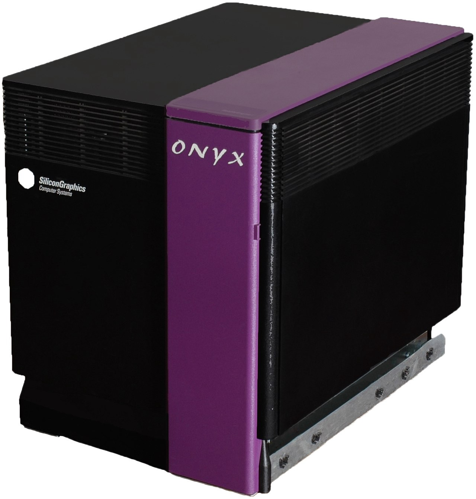A SGI Onyx system, used for N64 development, retailed for around $100,000–250,000 in early 1995

When Nintendo was marketing what the full power of the an SGI system in a home console form factor with a home console price. This wasn’t helped by the fact that the demos that Nintendo showed off were rendered on the incredibly expensive Onyx server-class systems. We’ve gotten used to incredible amounts of computing power being crammed into every smaller spaces thanks to smartphones and the cloud, but to put it in perspective, this would be like Microsoft hinting that the next Xbox would have the same power as an entire Azure rack.

The Onyx systems pictured above were actually often what was used for N64 development. In fact, one game studio told a rather funny story a few years later at a gaming convention about getting a call from the FBI asking why they were buying several military class super computers. Typically, this system would be used for developing 3d models, re-topologizing them, building the code, and because the architecture was similar enough, even run N64 simulations.

The Architecture
----------------

_Author’s note: This represented research from many sources on my part and there may be inaccuracies below. Feel free to drop a note with a correction and a source and I’ll fix it with a note making sure to mention you._

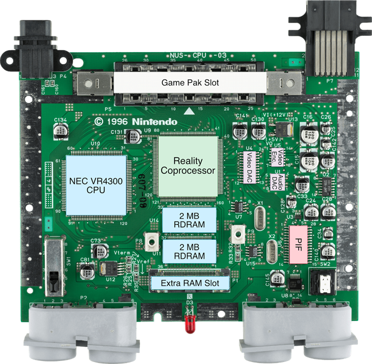
_Image from Rodrigo Copetti_

A big thanks to Rodrigo Copetti who [wrote an excellent blogpost](https://www.copetti.org/projects/consoles/nintendo-64/) about many of the things listed here. From here on out, it gets quite technical. Above is the main motherboard with the parts annotated for your benefit. Some of the most interesting pieces are the PIF, the Reality Co-processor and the NEC VR4300 CPU. The design of the N64 is largely from SGI, who according to one rumor, originally offered it to SEGA, who turned it down. Nintendo picked up the design and had a few different companies manufactured the chips. NEC for example, manufactured the chip on a special 35 µm process, a cost-reduced derivative of the more expensive MIPS R4200.

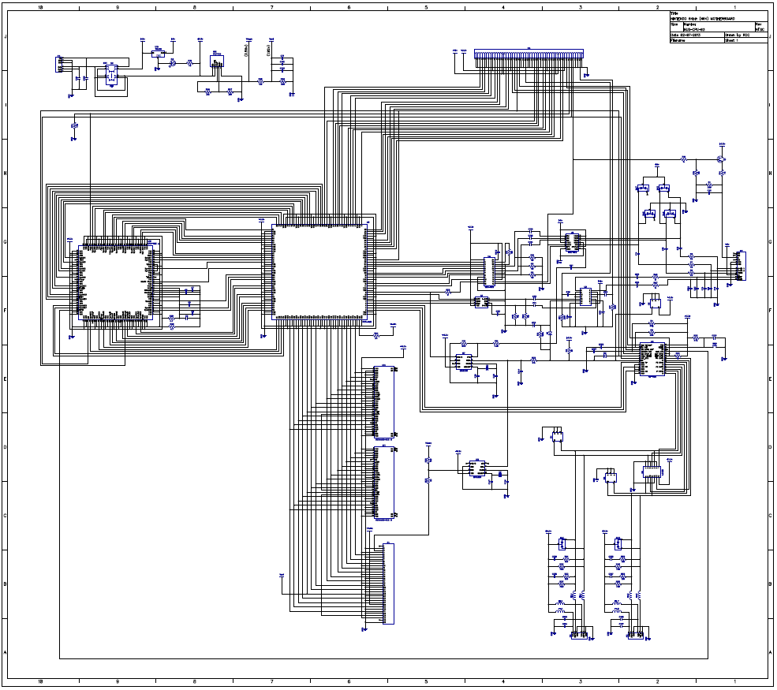The board schematic of the N64

An noted on the diagram above, there’s an extra RAM slot and on the console itself, there is a door to access the slot. The console came with a small connector block that terminates the ram connections. The RAM is chained together so if the block is removed, the system fails to enumerate all the RAM and you end up with a blank screen as the system waits for RAM that isn’t there. This is due to the rather constrained boot environment that we’ll get to later, but there simply isn’t enough hardware to get past this.

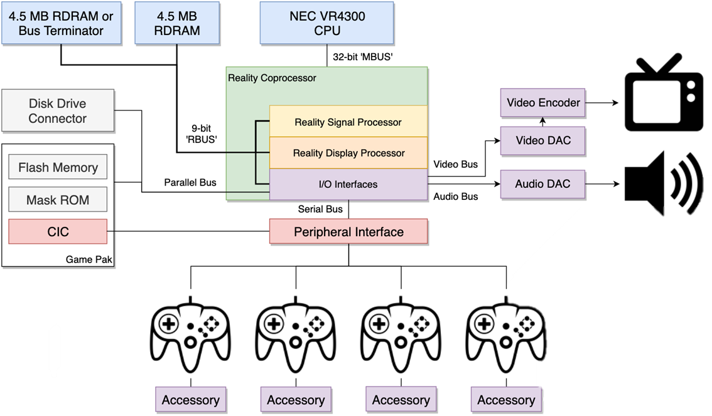an architectural layout of the Nintendo 64 (thanks to Rodrigo Copetti)

NEC VR4300
----------

The main CPU of the Nintendo 64 is a 97.75MHz MIPS III ISA CPU and was the largest volume of MIPS ISA based chips in the 1990’s (followed by the Playstation). It was a five-stage pipeline with a 64-bit floating point unit as a coprocessor but since it’s on the main data path inside the ALU it can stall the integer pipeline, so it works more like the floating point units in modern processors. It had an internal 64-bit bus but only a 32-bit system bus. Most N64 games used 32 bit instructions to conserve space as space on cartridges was expensive and 32 bits was accurate enough for most operations. It had a 24kb L1 cache, split 16kb for instructions and 8kb data.

Even though the N64 had a UMA (universal memory architecture), the CPU didn’t have direct access to the memory. Instead the RCP (reality co-processor) handled all the memory arbitration. The N64 used RDRAM, a cheaper type of ram that offered similar performance to the more expensive DRAM.

I mentioned that the CPU was a five stage pipeline. For those unfamiliar with processor design, here’s a quick overview. For those who are well-versed in these things, feel free to skip to the section about Nintendo’s custom ASIC, the RCP.

Five Stage Pipelines
--------------------

A five stage pipeline looks somewhat like this. This isn’t the actual stages for MIPS but it helps illustrate the point. There are stages, breaking up the steps involved in computing an instruction into smaller pieces.

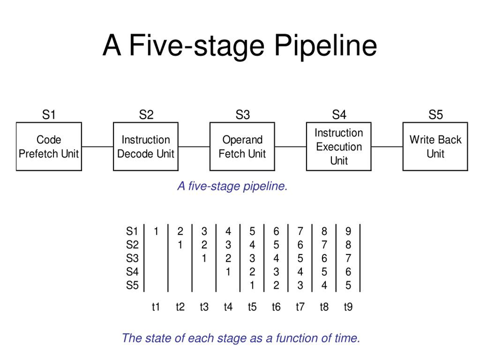

You do this for two reasons, speed and concurrency. By breaking it up into chunks, each part has a shorter “critical path” which is a fancy term for the minimum amount of time it takes for all the gates to switch to a stable state. You also can execute multiple instructions at the same time. You can be fetching the operands for an add instructions while decoding a multiply instruction at the same time. The penalty you pay for these massive boosts in productivity is latency and complexity. There was a time where Intel chips went for longer and longer pipelines (in the NetBurst era, pipelines reached a staggering 31 stages). An excellent paper about optimal pipeline depths can be found [here](http://citeseerx.ist.psu.edu/viewdoc/download?doi=10.1.1.93.4333&rep=rep1&type=pdf).

But adding more stages often allows for higher clock speeds, since you shorten the critical path. We’ve largely backed away from this as an industry (a modern Intel processor is 14 stages), which is partly why you’ll notice processor speeds haven’t changed that much in the past twentyish years (you could also make an argument that clock speeds haven’t gone up due to thermal constraints and have a very valid argument).

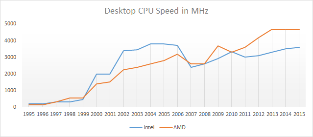

As a further explanation of the critical path, let’s talk about the two types of logic in digital design: combinatory and sequential. Combinatory has no notion of the clock. You put inputs and at some point later, the output comes out. Below is the picture of a full adder circuit.

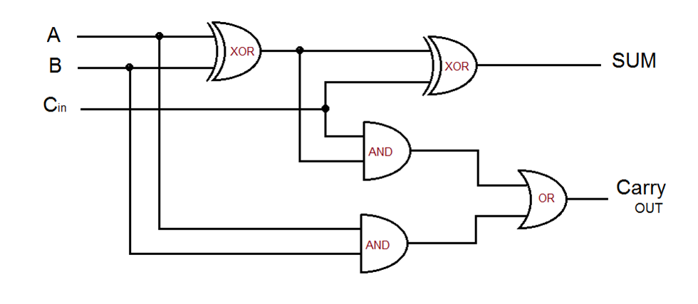

It adds two one bit numbers together along with a carry in. It will output a two bit number (carry out being the higher order bit). If you put in A= 1, B = 0, C= 1; you’ll get Sum = 0 and Carry out = 1 because 1+0+1 = 2 or b10. This is what I meant by the critical path. In this particular circuit, the critical path is from A and B to the Carry out. This is what will take the longest to come to a stable state. It passes through the most gates (though some silicon processes optimize the number of transistors and the switching speed of different gates so the number of gates is not always the determining factor, but it is a good rule of thumb).

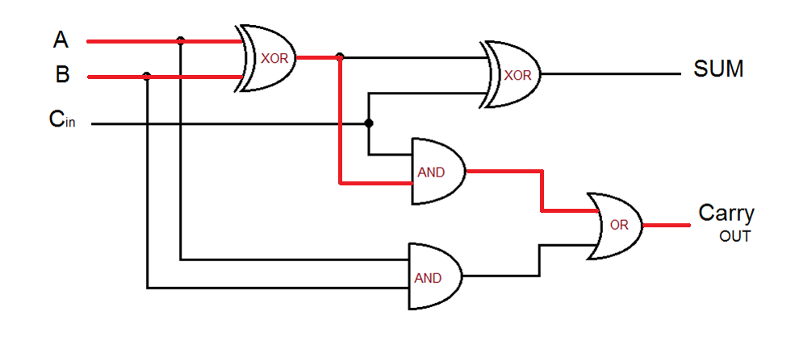the critical path (in red)

Here’s where things get tricky. A full adder capable of adding multiple bits together is chained together with the carry out going into the carry out of the next stage. As you can imagine, the result sort of propagates through the adder eventually some amount of nanoseconds later, popping out the other side. This is why you can only clock a computer so fast as at some point, the results start being wrong if you look at them too early.

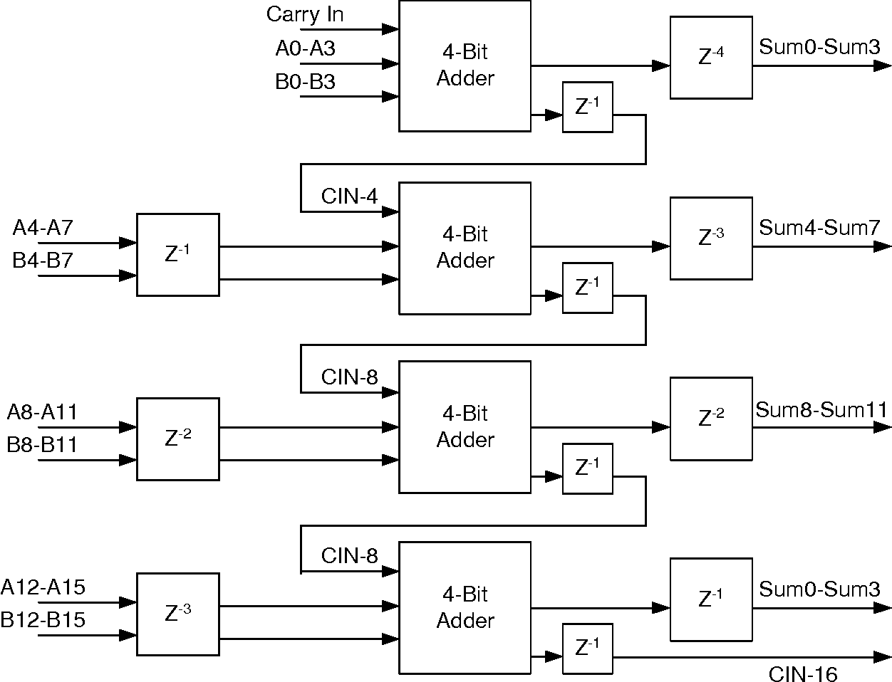A chained adder, thanks to [W. C. Lin](https://www.semanticscholar.org/author/W.-C.-Lin/46639829) and [H. Rattanasonti](https://www.semanticscholar.org/author/H.-Rattanasonti/8032478)

That brings us to the next type of logic, sequential. Sequential logic is just combinatory logic with flip flops (logic that can store values, think of it like a gate that can hold one value and every time the clock ticks it saves whatever it is currently reading and starts outputting that). The diagram below illustrates the pieces of a typical pipeline (this is not the exact MIPS III pipeline but close). You can see the flipflops are the large vertical green bars that store state in-between pipeline stages.

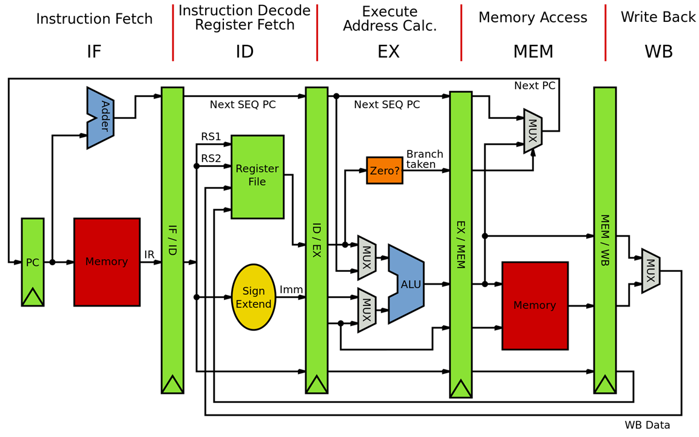

There’s instruction fetching, where instructions (thanks to RISC they’re all the same size, roughly) are read from memory and then passed into the next stage. Instruction decoding is where a giant lookup table processes what to do. Think of it like a giant block of if’s in a programming language but all the if’s are evaluated in parallel. The arguments are also fetched from the registers. The execute phase is where the operations happen. This is also where the floating point co-processor lived. Adds, multiplies, and branches are evaluated and then sent onto Memory Access, which varies from processor to processor but you can think of it like anything that needs to use memory does so here. This means one cycle and two cycle instructions can both terminate at the same time so the complexity goes down a bit. Write back is just the results being put back into the registers. A great resource is the [Wikipedia article](https://en.wikipedia.org/wiki/Classic_RISC_pipeline) on the classical RISC pipeline.

One more interesting note about the Nintendo 64 CPU specifically is that it has delay slots. As you can imagine, if you get a jump or a branch instruction, you don’t know if you’ll branch or where you’ll jump until a few stages in. A more modern processor has branch prediction and lots of invalidation techniques for the speculative execution. It’ll predict if the branch will be taken or where the jump will be. If it predicts wrong, it can invalidate the work that it did, stall the pipeline, and start fresh. The five stage pipeline is short and we know within a cycle where we’re going to jump to or the branch we’ll take. This does mean that we have an extra cycle where we don’t know yet. So on the N64, every instruction after a branch or jump is executed. This technique is known as a delay slot. For example,

> **jal dest  
> addi t0,t0,1**

The add immediate will execute after the jump. The N64 assembler (as many MIPS assemblers) have an option to insert NOP’s after each branch and jump and link. It also offers the opportunity to use a cycle that would otherwise be wasted.

There’s more that could be said about processor design and pipelines such as data hazards and loop back lines, but perhaps I’ll cover that in a future article.

As mentioned before, the CPU doesn’t have direct access to memory and can’t do DMA. It didn’t have memory pre-fetch so this was the biggest performance bottleneck of the N64. Later analysis by Nintendo showed that 50% of the console’s idle time was simply waiting for memory. There was DMA on the unit but that was controlled by the RCP and was difficult for the CPU to manage.

RCP — Reality Co-processor
--------------------------

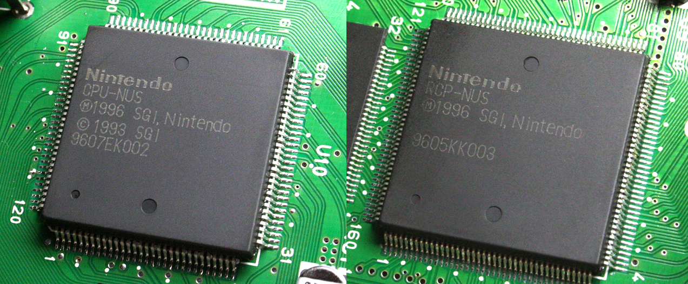The CPU and RCP of the NUS (Nintendo Ultra SixtyFour)

This is the custom ASIC that has a lot of SGI magic in it as well as all the glue logic that Nintendo would normally put in discrete chips. The RCP has three parts: RSP (reality signal processor), and the RDP (reality display processor), and the RAM controller. The RCP has a 9 bit bus to memory and can address and extra half megabyte of RAM that the CPU can’t address.

The RCP was the secret sauce of the N64. It had a whole separate processor with tons of specialized circuitry. This was a clear advantage over the competition as it allowed developers to offload work onto it. However, it could also be tricky. Do you do audio on the CPU or the RCP? You can adjust the graphics on the fly and put new microcode on it if you really desired (I don’t think any game did this). How do you handle that?

Modern GPU’s have actual graphical processors. You can pass them points and they’ll apply matrix operations and transformations. Most of the consoles of the N64’s generation were just simple raster systems. You passed them triangle data and they rendered it on the screen with no transformations. You had to do all the perspective calculations, culling, and z-depth ordering on your CPU, eating into your precious cycles. So there was a tradeoff between framerate and the number of things on the screen at one time.

In terms of function, the RDP did per pixel operations and the RSP did vertex and geometry calculations. You can think of it like vertex and pixel shaders. Sort of.

It ran at 62.5 MHz and had logic for talking to game cartridges, driving timing across the console, and included interface for audio, serial, video, and other interfaces. Most, if not all, I/O of the N64 is routed through here. Below is a annotated decapped chip.

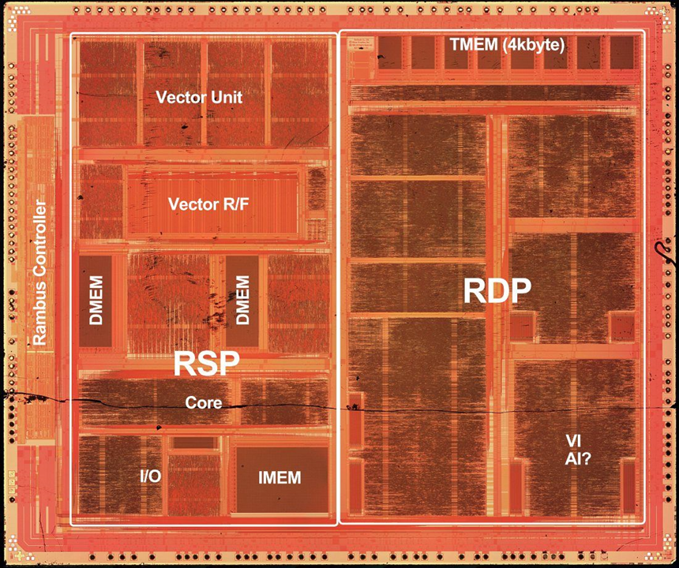

You can see on the left is the signal processor. It’s laid out much more like a CPU as it’s got lots of discrete sections. It’s got a huge vector unit up on the top left and lots of logic in the core. The RSP was actually another MIPS CPU with extra 8 bit opcodes for the vector operations. Additionally, the RSP could do audio like MP3 decoding, midi processing, or wave table look up.

The RDP is less CPU like and more focused on processing. It’s not laid out like a CPU. It’s laid out more like a GPU, though modern GPUs are more like thousands of tiny processors that share state. The RDP was much more focused on rasterizing than on rendering.

You can see here there’s separate memory for data (DMEM) and instructions (IMEM). It’s mapped into the same address space with instructions. The cache is actually memory mapped to 0xA4001000 and 0xA40000000. Registers are also memory mapped mapped starting at 0xA4040000.

The RCP has an internal bus known as the XBUS that allows the RDP and the RSP to communicate. The microcode in the RSP defines the method for transferring data to the RDP and three methods were supported: FIFO, XBUS, and DRAM. FIFO was a queue in RDRAM that the RDP could read from that the RSP writes into. XBUS uses the bus inside the RCP and just directly passes messages from the RDP using an internal queue inside the RDP. DRAM uses the RDRAM exclusively and allows the CPU to move commands over to RDP ram.

RSP — Reality Signal Processor
------------------------------

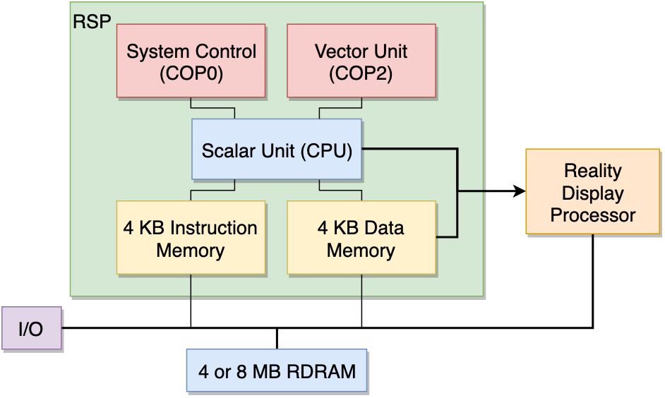

The RSP is actually a complete separate RISC processor and has an 8 way, 16 bit vector processing processor. The RSP handled geometric transforms, clipping, culling, lighting calculations, and occasionally audio. Since it’s a bespoke microcontroller you need to boot it up. Inside the N64 SDK, five different microcodes were offered with different levels of functionality.

*   gspFast3D — most full features, including shading and fog (used in Mario 64)
*   gspF3DNon — same as Fast3D but without near-clipping
*   gspLine2D — does not render triangles so it gives a wireframe effect
*   gspSprite2D — efficient for 2D sprite images
*   gspTurbo3D — faster than Fast3D but reduced precision

These microcodes were written by Yoshitaka Yasumoto, a developer for Nintendo. Several other microcodes were developed over the course of the N64’s lifetime but due to SGI’s earlier experience with releasing developer tools for their proprietary tech, SGI was very reluctant to release any sort of debugger or documentation for the RCP. It was eventually reverse engineered and a few games, but the vast majority used one of the default microcodes. Indiana Jones and the Infernal machine, Star Wars: Rouge Squadron, and Star Wars: Battle for Naboo were all games that used a custom microcode to push the console hard and output at 640x480 rather than the much more common 320x240. All three of those games were produced by the same game studio, Factor 5. Over the course of the N64’s lifetime, several more microcodes were released such as Fast3DEX (Mario Kart 64), Fast3DEX2, and Fast3DZEX (Zelda extended).

The main processor communicated with the RSP by putting 64 bit words into the shared memory space and the RSP read them in and executed them according to the microcode loaded. You can kind of think of it sort of like OpenGL , where there are operations you can call. Perspective projection, clipping, and lighting are just some of the things.

RSPBOOT was a short piece of code that was used to boot the RSP. It was 208 bytes by default and loaded the microcode. It was loaded into IMEM but the bootstrapping process for the N64 so it needs to fit in 4KB (1,000 instructions). This means you need to set initial registers and get things in a state where things can run and load in the next section of microcode within 1,000 instructions. A typical N64 game project includes this:

> include “codesegment.o”  
> include “$(ROOT)/usr/lib/PR/rspboot.o”

Which just includes a bit of data to specify a data segment and then the boot blob. The boot flow of the main processor typically looks like this:

1.  Initialize N64 CPU CP0 registers
2.  Initialize the RCP (such as halt RSP, reset PI, blank video, stop audio). This is where rspboot.o is loaded into the RCP.
3.  Initialize RDRAM and CPU caches
4.  Load 1 MB of game from ROM to RDRAM at physical address 0x00000400
5.  Clear RCP status
6.  Jump to game code
7.  Execute [game preamble code](http://n64devkit.square7.ch/keywords/index/data/system.htm#game%20preamble%20code) (which is similar to crt0.o and is linked to game during [makerom](http://n64devkit.square7.ch/n64man/tool/makerom.htm) process) which clears the [BSS](http://n64devkit.square7.ch/keywords/index/data/system.htm#Bss) for boot segment (as defined in the spec file), sets up boot segment [stack](http://n64devkit.square7.ch/keywords/index/data/system.htm#stack) pointer, and jumps to the boot entry routine
8.  Boot entry routine should call [osInitialize()](http://n64devkit.square7.ch/n64man/os/osInitialize.htm)

RDP — Reality Display Processor
-------------------------------

The RDP is, at it’s core, a rasterizer. It receives commands via the XBUS or the RBUS, which means both the main processor and the RSP can issue commands. The RDP doesn’t technically include the IO interfaces, but it’s connected to the internal XBUS so the RSP can talk to the audio and video interfaces.

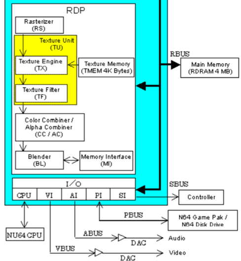

Interesting enough, the RDP could handle triangles _or_ rectangles and had 9 bit bytes (thanks to that extra bit to address RAM), which it used to store depth. It used the IO interface to use DMA to write the output video image to a section of memory that the video encoder could see. That was then sent out over the VBUS to a DAC. The Audio worked similarly.

You’ll notice that the texture memory unit is only 4 KB. That’s tiny even by the standards when the N64 was made and this is by far the largest technical challenge of the N64. To do mipmapping (where you have two of each texture, one for up close and the other for far away), you effectively have 2KB of texture. For context, the image below (at 798 by 599px) in a compressed PNG size is 609.9kb. 4Kb also means about a 37 by 37 px image in 8 bit per color BMP without compression.

For context that’s about this size:

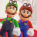37 by 37 image

It’s funny reading [articles](https://www.ign.com/articles/2000/11/10/bringing-indy-to-n64) from the early 2000’s about development of games for the N64 (for example Indiana Jones and the Infernal Machine). The developers mention the 4k textures and you start to wonder how they’re fitting 4k textures but then you realize, no that’s KB not 4096x2160. Many games had to get ridiculously clever with texture reuse. Many games such as the Mario 64 elected to use simple color Gouraud shaders rather than textures. Since the N64 was fill rate limited instead of geometry limited, many games also elected to represent some items as sprites instead of full geometry. You’ll notice in the scene below that the red bomb-bomb characters are actually just rectangles.

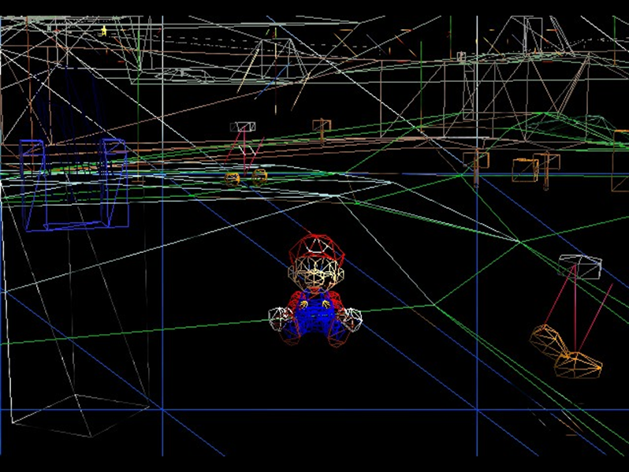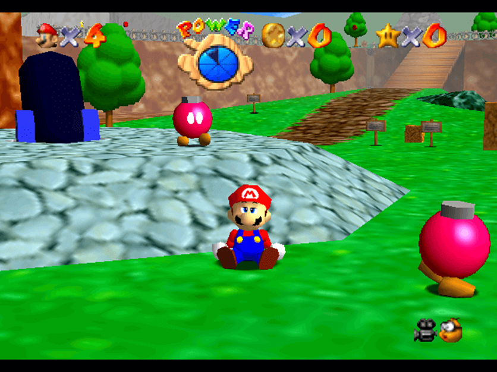

The most the N64 could output was 24 bit color 640 by 480 but generally games chose a more conservative 320x240 as this conserved resources.

Audio
-----

As you saw on the original motherboard diagram, there is an audio DAC. How does a game get the data from the cartridge all the way to the DAC and out through the outputs in the back of the console. You simply encode them as discrete voltages, but remember Nyquist theorem means you need a sample rate of 2x the highest frequency. So having a 16 bit sample for two channels means 32 bits per sample at 14khz per second. 60 seconds of audio is 3MB, which is often the whole size of your cartridge. A CD could easily hold 600MB which means you don’t need to encode or compress it. Just play it. Eventually cartridges got up to 64mb but it took a few years.

This made it tricky to port games over to the N64 from the PS1 since the music often would need serious compression or to be stripped all together. Unlike it’s predecessor and other consoles of earlier generations, the N64 doesn’t have a dedicated audio chip. The SNES and NES have dedicated chips that could be configured (to produce music known as chiptunes). For the N64 you can choose to play on the main CPU or the RSP (with the right microcode loaded). In fact, this is rumored to be the reason a few popular PS1 games remained exclusive. Because the directors weren’t happy with having to strip the beautiful music they created.

With the size constraints The RSP can play ADPCM (voltage samples) or MIDI data. Many games opted to create their own MIDI synth with custom samples. Other games generated the music at runtime.

Somewhat mysteriously, it is music that is largely credited with the Nintendo 64’s place behind PlayStation. Many incredible games such as Metal Gear Solid reportedly were unwilling to port their games to Nintendo 64 as the resulting compression in music rendered it unlistenable and it would need to be cut. Some PlayStation games leveraged the fact that you could swap disks while playing and continue the game. Doing this for the N64 would have been prohibitively expensive as one cartridge was expensive enough.

CIC and PIF
-----------

There are two more important chips and only one of them is on the N64. The PIF is the Peripheral Interface Bus. This talks to the [CIC](https://en.wikipedia.org/wiki/CIC_(Nintendo)) (checking integrated chip) on the cartridge and acts as the largest source of security for the N64. It has a 2KB IPL (initial program loader) which talks to the cartridge and does region-lock and anti-piracy verification. It then loads the next IPL from the cartridge and this is how the main CPU is booted, when the bootstraps the RSP. In the cartridge below you can see the main cartridge memory chip on the right and the CIC on the right.

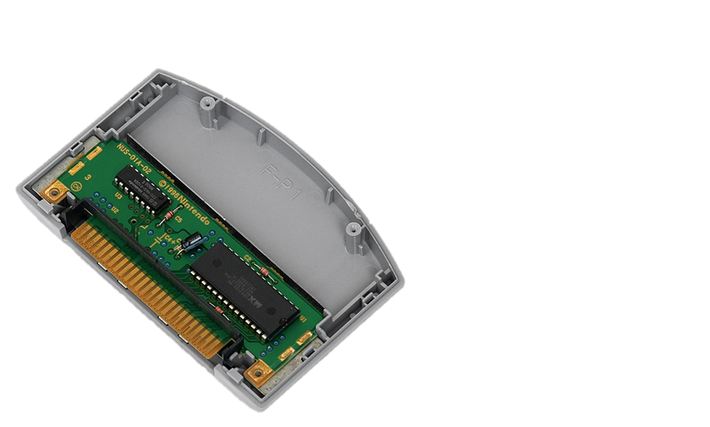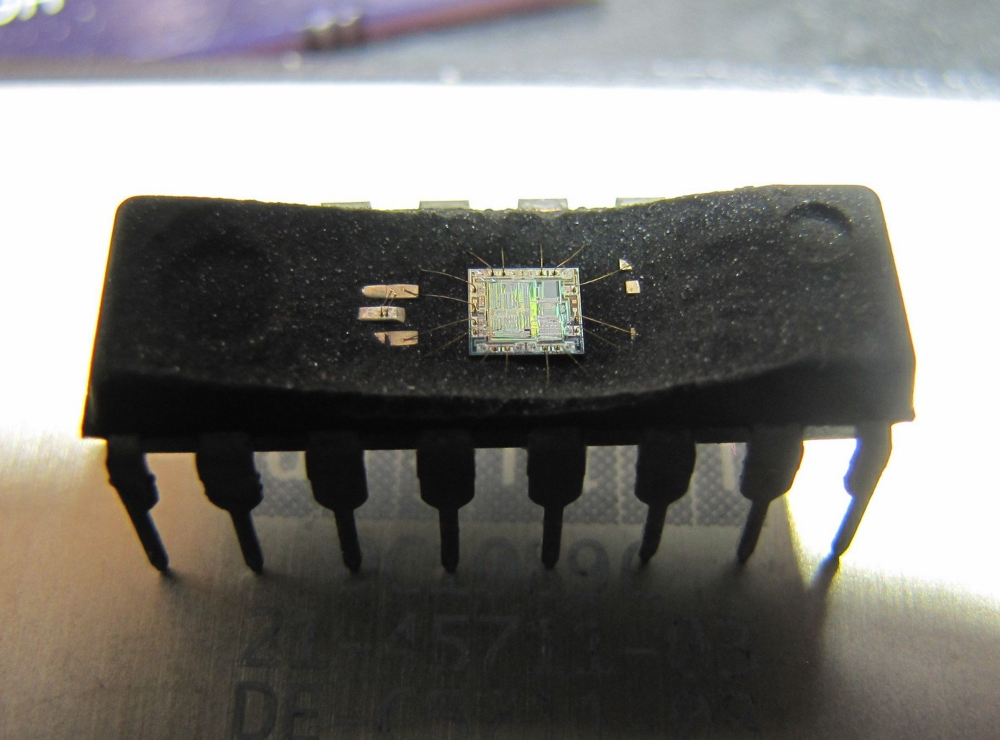

An excellent talk on reverse engineering the CIC was done by Mike Ryan, marshallh, and John McMaster and it can be viewed [here](https://www.youtube.com/watch?v=HwEdqAb2l50). The NES and the SNES both included CIC chips, though much simpler than the one used in the N64 as each generation Nintendo improved the design. In fact, the N64 CIC wasn’t cracked until 2016. Below is the decapped chip with the PIF on the right and the CIC on the left. You’ll notice they both share a similar hashing SM5 cores (in the blue box) which allows them to compare hashes and make sure they match as they communicated over a SPI like bus.

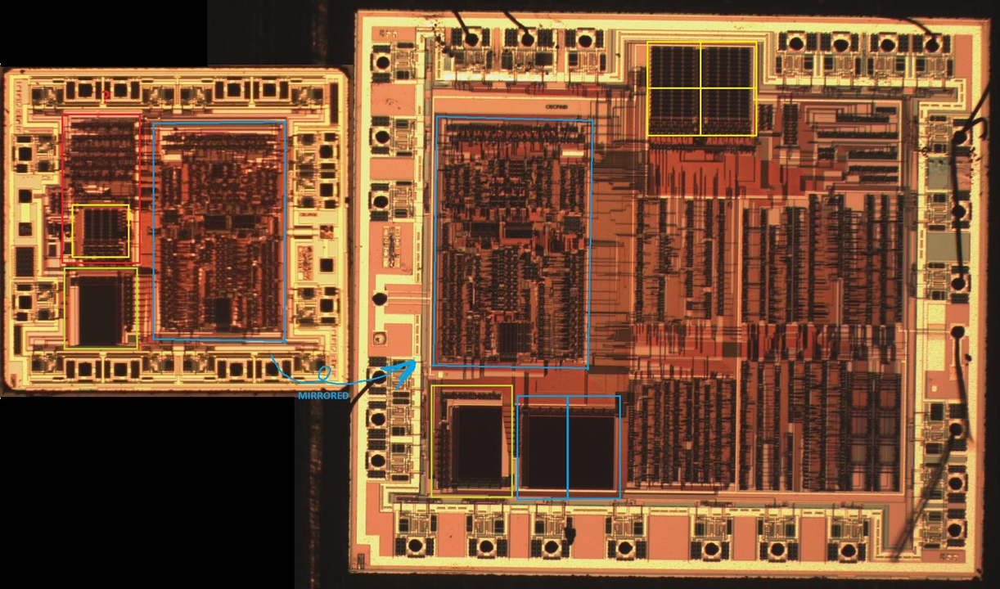

There are ten different versions of the CIC, five for PAL and five for NTSC.

SDK
---

Like the Xbox 360 and several other consoles of the era the N64 did have a rudimentary operating system. But rather than being a system that loaded the game, the operating system was built into the game code via the SDK.

The main CPU had thread units and the RCP had tasks (since it was structured much more like a RTOS). There’s plenty of information in an unofficial website that lays out a lot of the Nintendo documentation that can be found [here](http://n64devkit.square7.ch/).

Emulation
---------

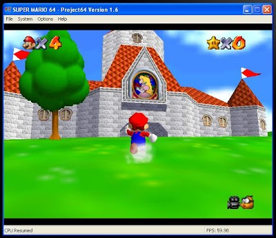

Now you might be asking “wow, this all sounds really tricky to emulate.” And yes, you’re right. It is tricky. So most N64 emulators cheat. They hash the RSPBOOT block and the accompanying microcode and match it against a native C library that will process the RSP commands from the main CPU. This does mean that if there’s an obscure game out there that had it’s own custom microcode, the emulator might not work. I believe it just loads a best guess microcode and hopes for the best, but that varies emulator by emulator.

It also doesn’t have to be cycle accurate. Thanks to the extra size of the 64 bit instructions, they were used sparingly, if at all, so it makes it easier to emulate on 32 bit systems (which aren’t as common these days).

There are some emulators that focus on cycle accuracy, but I think that is largely talking about cycle accuracy of the main CPU rather than perfectly recreating the RCP. Granted that also involves making sure the timing on the RCP is correct, which is a daunting task to say the least.

The Technical Impact of the N64
-------------------------------

The impact of the N64 can still be felt today. The designers of the RCP system later went on to form ATI, which was bought by AMD. They designed the GPU inside the Gamecube as well as some of the Radeon graphics cards.

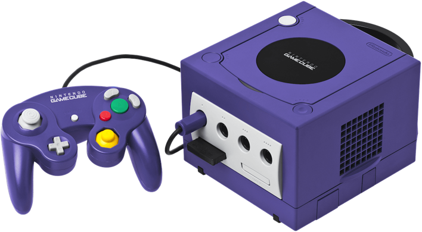

The Gamecube swaps out the SGI internals for IBM PowerPC but it kept a lot of similarities in the graphics system and memory layout. They tried to address the memory issues in the N64 by using DDR ram (which came out in 1998, two years after the N64) as well as giving the GPU it’s own memory space.

The Legacy of the Nintendo 64
-----------------------------

The legacy and impact of the Nintendo 64 continues to this date. People like myself write these articles. People like you read them. I personally have fond memories of the Nintendo 64 as it was the first video game console allowed in the house growing up. I had played NES and SNES at friend’s houses, but my mom had a fairly strict no video games policy. However, my dad won a Nintendo 64 at a technical conference as a prize and she couldn’t quite bring herself to say no.

Interestingly enough, many consider the Nintendo 64 to be the era where Nintendo lost its foothold in the market. The risks taken by Nintendo like the analog stick, the push for 3d, and the relentless focus on quality over quantity; could have left it as another piece of plastic. Instead they all resulted in a lasting legacy even though the PlayStation sold more than double the number of units (largely a function of the length of time PlayStation was on the market, but even at its peak, the Nintendo 64 was selling less per week than the PlayStation).

GoldenEye 007 is credited as the first successful first-person shooter on console. When Sony introduced their dual-shock controller for PlayStation just a year and four days later, the innovation can be credited to Nintendo and Sony just wondering what would happen if you had two of them since you had two thumbs.

Super Mario 64 laid the groundwork for how 3D characters move and interact with the world around them. Gabe Newell, Cliff Bleszinski, and many other developers have credited Super Mario 64 to being a huge influence on them as creators.

Fire up that emulator or dust off the console and let the nostalgia wash over you. Or perhaps try and see past the old graphics and marvel how far we’ve come in just 20 years.

More Resources:
---------------

[http://n64.icequake.net/mirror/www.jimb.de/Projects/N64TEK.htm](http://n64.icequake.net/mirror/www.jimb.de/Projects/N64TEK.htm)  
[http://n64devkit.square7.ch/n64man/](http://n64devkit.square7.ch/n64man/)  
[https://www.copetti.org/projects/consoles/nintendo-64/](https://www.copetti.org/projects/consoles/nintendo-64/)  
[http://n64devkit.square7.ch/](http://n64devkit.square7.ch/)  
[https://www.retroreversing.com/n64-hardware-architecture/](https://www.retroreversing.com/n64-hardware-architecture/)  
[https://en.wikipedia.org/wiki/Nintendo\_64\_technical\_specifications](https://en.wikipedia.org/wiki/Nintendo_64_technical_specifications)  
[http://n64.icequake.net/doc/n64intro/kantan/step1/index.html](http://n64.icequake.net/doc/n64intro/kantan/step1/index.html)

