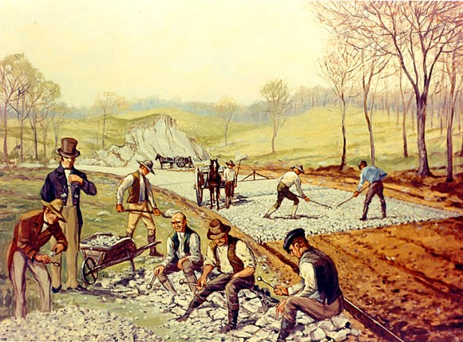
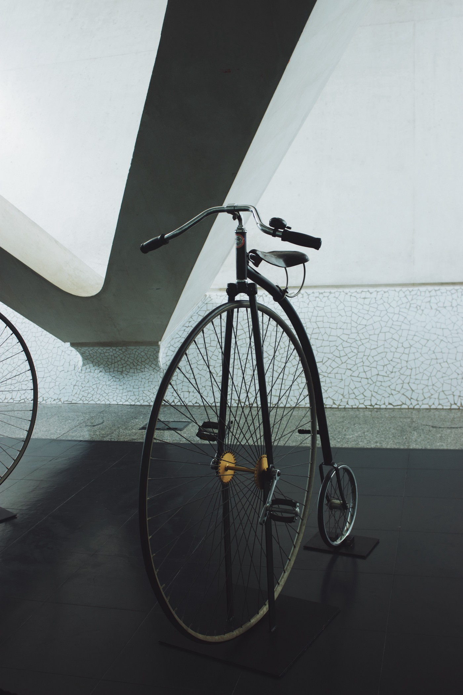
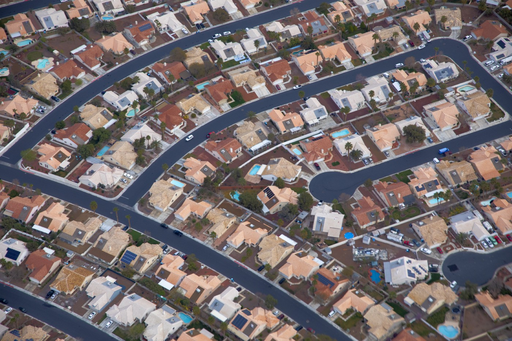
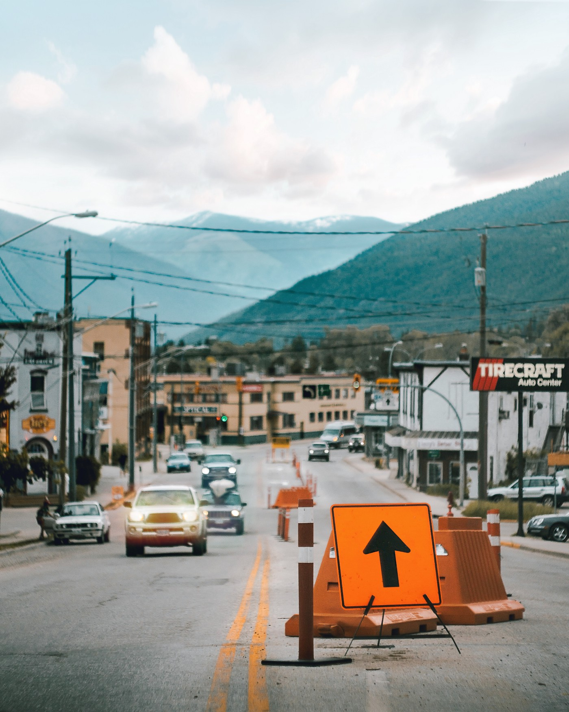
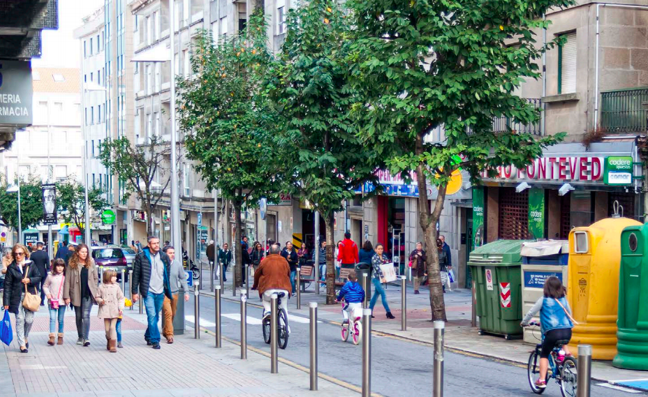
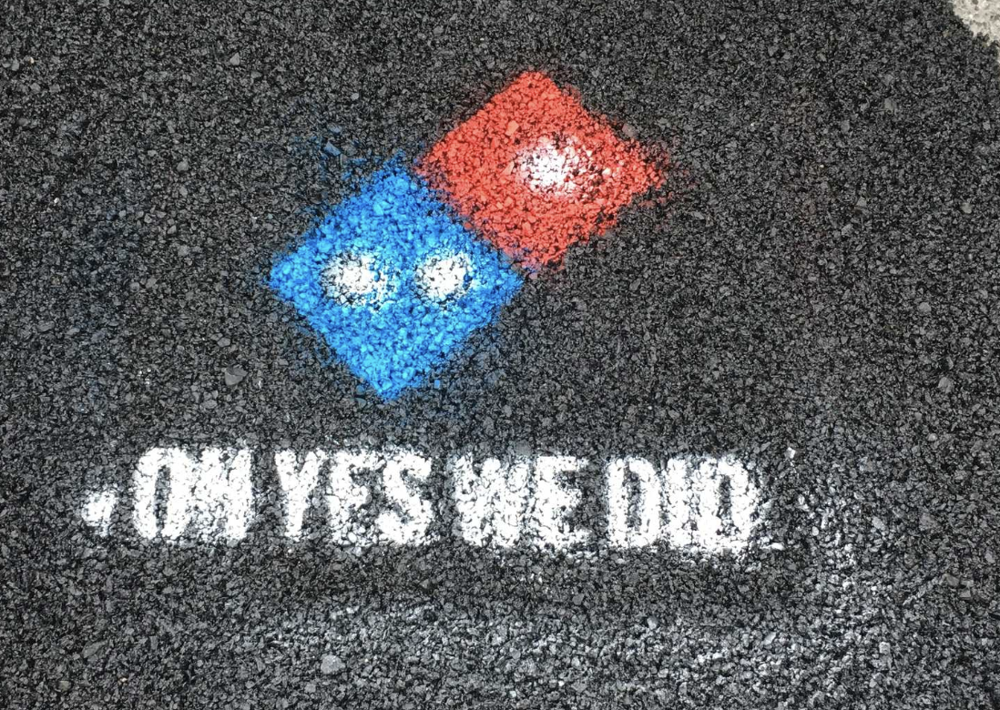
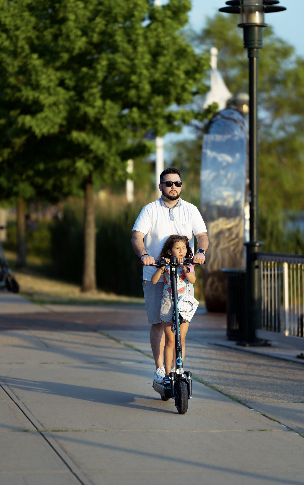

*Editors Note: Originally posted [on medium](https://medium.com/@matthewfcarlson/roads-where-were-going-we-won-t-have-any-roads-dd9e5a27c30d) by me*

At least, the way things are going here in the USA. __Our roads, as we currently handle them, are unsustainable.__ As city and states are financially stretched in different and difficult ways, the incredible cost of road maintenance and construction is getting harder and harder for policy makers and government workers to manage. At the rate we are going there will be significantly fewer roads, more traffic, higher taxes, and more pot holes than either you or I could imagine in our worse nightmares.

We as a country have focused so much on expansion and didn’t pause to consider how we would maintain the roads that we built. Cities, counties, and states are going to go further into a hole of debt that they run the risk of going so deep they can’t tax their way out of it.

I talked to a local city council member, Michelle, since her comments and actions inspired me to write this.

> “You spend every nickel you have on infrastructure and it still decays faster than you can pay to fix it. Eventually the debt load outstrips the ability of the tax base to provide. 100% of revenue goes to service debt of the already deteriorated roads. As a city, you can’t fix the ones you have. You also can’t build more. It’s a hole so deep you can’t tax your way out. We’ll need a fundamental shift in how we live and do transportation in the US to avoid it. And I don’t think we will be able to avoid it because no one will be able to agree it’s broken.” — Michelle, City Councilor

## How did things get this way?
### It starts with how roads were built in America and why. It wasn’t the car but the popularity of the bicycle that started the push for smooth, flat roads in the early 20th century. Cities centers enjoyed cobblestone, railroads, and trolleys while rural areas were dirt, mud, gravel, or dust depending on the season. Cities at the timer were smaller, denser and there were no suburbs. So rural might mean just a mile outside of the city center.

The common practice of the USA at the time was that the majority of rural roads would be paid for, built, and maintained by the local landowners that the roads were on, not the city or state. A common type of road was the macadam road, which was built by hand-chiseling various layers of rocks to specific sizes and spreading them at precise grades. As you can imagine, this was tedious and expensive and simply out of reach for most landowners. Laying tar to seal the top layer of the macadam to give a smoother surface (known as pitch macadam) was fairly uncommon, as it was added cost and the existing macadam roads worked just fine for horse drawn carriages and pedestrians.

Construction of a [macadam](https://en.wikipedia.org/wiki/macadam) road, “Boonsborough Turnpike Road” between Hagerstown and Boonsboro, Maryland, 1823. Inspired by the work of [John Loudon McAdam](https://en.wikipedia.org/wiki/John_Loudon_McAdam). (Painting by Carl Rakeman — This image is in the Public Domain)

A newly popular invention, the bicycle, rose into the public eye in the 1890s causing those who owned a shiny, expensive bicycle to push for places to ride them that didn’t hurt your butt. As evident in the picture below, there was very little padding on the seat. Given that most rural roads were gravel or dirt, only those in the city were able to enjoy bicycles as a means of transportation since the cities had paved roads. What started as a local agitation of the League of the American Bicyclists for better rural roads turned into a national political movement known as the Good Roads Movement that lasted from the 1870s to the 1920s. In 1893, just 28 years after the end of civil war, the Office Of Road Inquiry (ORI) was established to work towards new rural road development. Particularly, they cited the practices in Europe that cities and counties maintained, built, and paid for the roads. Their budget and the road technology of the time restricted their progress and scope through the 1890s and early 1900s.

Photo by [Haut Risque](https://unsplash.com/@hautrisque?utm_source=medium&utm_medium=referral) on [Unsplash](https://unsplash.com?utm_source=medium&utm_medium=referral)

As you may know, Henry Ford began to sell the Model T Ford in 1908. What was crucial about the Model T is both the mass-production techniques that enabled a low-cost as well as the ethos that Ford himself spread that everyone who worked at the factory should be able to afford the cars that they built. He did this by increasing the wages he paid as well as focusing on cutting costs. This was the start of the American Car Dream(tm). The idea that every American not only needs but deserves a car. That there is no freedom like the open road and other slogans that clever marketing would ingrain in our culture over the next hundred plus years.

As more Americans had access to cars, rural votes began to lobby for paved roads. World War I put the construction of roads on the backburner, but once it was over, the Federal Highway Act of 1921 renamed the ORI into the Bureau of Public Roads (BPR) and gave them the funding needed to pave two-lane interstate highways. The actual construction was done by state highway agencies, who by the 1930s were looking for jobs for their unemployed citizens. It was the USA’s entry into World War II and the real possibility of fighting within the countries borders loomed that the military started to consider how they would move troops, tanks, and equipment from one side of the country to the other. The focus of road maintenance and construction was solely on the roads that would benefit the military if such a battle were to occur. Naturally, many roads were neglected and fell into disrepair. FDR signed some legislation that sought to revitalize these neglected roads in 1944, but it didn’t get the funding it needed until 1956 with the Federal-Aid Highway Act signed by Eisenhower.

With the construction of new roads, there began to be concerns about how the sheer quantity of new roads affected the environment, the layout of cities, and the usage of mass transit. The US Department of Transportation was established in 1966 and the BPR was renamed to be the Federal Highway Administration (FHWA). Over the next few decades, the interstate system welcomed 42,800 miles to its system.

At the same time, the dream of suburbia began to take root. The economic boom and the return of many from overseas caused a dramatic reorientation of the American ideal home. Before World War II, Americans had moved into the cities to find jobs and housing. In the post war years, the suburban areas around cities saw dramatic growth which city centers shrunk. By 1960, almost as many Americas lived in suburban areas as in city center and this trend has continued since. This was in part by the housing crunch as well as the GI bill that allowed young veterans to buy homes with no money down. The housing crunch of the 1940s and ‘50s had several factors such as the fact that virtual no new housing had been built during WWII, the GI bill that allowed returning veterans to buy homes with government guaranteed loans and zero money down, and the accompanying baby boom.

In 1940, only two in every five Americans owned their own homes. By 1950, it was more than half. By the mid 1960s it was over two thirds of Americans and that rate has roughly held to present day. Some historians say that we will likely never see that same kind of pent-up housing demand that existed in the late 1940s.

Photo by [Jean-Philippe Delberghe](https://unsplash.com/@jipy32?utm_source=medium&utm_medium=referral) on [Unsplash](https://unsplash.com?utm_source=medium&utm_medium=referral)

The market in the 1950s and ‘60s responded by the application of mass production techniques to home construction by Arthur Levitt. Other developers followed Levitt’s lead, buying up cheap land outside the city and building houses quickly and cheaply. There are accounts of hundreds of acres outside Lakewood, California just 15 minutes south of LA with cement trucks waiting in a line over a mile long to pour foundations for mass produced homes. These were not apartments, complex, or duplexes. The houses that developers were putting in were detached single-family houses, as they were easy to sell and cheaper on account of the assembly line techniques perfected for building airplanes in war time. In fact, their homogenous nature lead to many criticism of the suburb lifestyle including the song “[Little Boxes](https://www.youtube.com/watch?v=HlSpc87Jfr0)” by Pete Seeger. This article does not seek to address the large racial injustice done towards people of color and their families when it came to moving to these affordable homes, as most of these housing developments and many government loan programs were almost exclusively for white families. However I encourage you to [learn](https://www.youtube.com/watch?v=ETR9qrVS17g) [more](http://web.archive.org/web/20130506033211/http://www.portal.state.pa.us/portal/server.pt/community/documents_from_1946_-_present/20426/levittown/999080) about it and look into what can be done today to help better integrate our society and support underprivileged or marginalized communities.

In just three years, the empty farm land south of Los Angeles, California was transformed into a city of 90,000 people. With this glut of housing came roads. You need cul-de-sacs. You need access roads. You need large roads to get into the city from the suburbs. Traffic lights and stop signs. Interchanges and highways with on-ramps and off-ramps. So developers built the roads for their neighborhoods and in some cases, cities paid for these roads to incentivize the developers to build within their city bounds. We as Americans expect to be able to drive somewhere and get to anywhere we want via our car. Can you imagine moving somewhere where you car couldn’t take you to certain parts of town? Or not being able to get to certain cities? So of course developers and cities made sure new neighborhoods had a way of getting around, connecting it to the state’s ever-growing network of roads.

Some folks say that America is addicted to cars and this is largely true. We need it like an addict because we can’t function without it. We as a people love our cars and we love the open road.

But this doesn’t answer the question of who pays for the road.

## Who pays for the roads?
We’ve seen the cost and burden of roads shift from private land owners to cities and states. In response to this, a gas tax was introduced in 1932 to maintain and build roads and highways. There is the federal gas tax (18.4 cents per gallon at time of writing) as well as a state gas tax (in Washington, it is 37.5 cents per gallon at the time of writing). How the money gets distributed is a bit murky and changes based on policy, but in general Federal funds are used for interstate and state funds are used for state roads. In 2007, Mary Peters, then US Secretary of Transport, stated that 60% of federal gas tax funds were used for highways and bridges. The rest went towards other transportation projects.

As Michelle states, cities and counties struggle to pay for the roads they have and often cover it by building more roads.

> “Basically new development on the edge doesn’t actually cover its true costs. The tax revenue it generates is less than the cost of the services and infrastructure it consumes. But everyone assumes all new growth is good growth. Existing roads are primarily maintained using development fees from new growth. That collapses when there is no more room in a given city for new growth. Also remember that the same road issue also applies to water and sewer systems as well.”-Michelle

For cities needing funds for roads there are programs available, but the funding available is often smaller than needed and all the cities in a region are competing for the same small slice of funding. Often a road will be 20% federal money, 50–80% city funds, and the rest being bonds or other forms of debt. As with many things political, the funds are distributed based on political needs rather than physical need.

Even with the gas tax, it isn’t enough. According to the Department of Energy, 142.17 _billion_ gallons of finished motor gasoline were consumed in 2019. With an estimated national population of 327,167,434 as of 2018, that comes out to roughly 434 gallons per person. I realize this is a rough estimate and doesn’t factor in actual consumption since that number is total population and includes those who do not drive. Based on current taxes rates, this means a town of 90,000 people generates $14,647,500 in state taxes and $7,187,040 in federal taxes. At $14 million and $7 million for a combined 21 million dollars, you might be saying, things are looking pretty good. That’s a lot of road you could buy with that. Not so fast.

Photo by [Finn Gerkens](https://unsplash.com/@finnsn?utm_source=medium&utm_medium=referral) on [Unsplash](https://unsplash.com?utm_source=medium&utm_medium=referral)

If you were to use that city’s gas taxes at the federal and state level exclusively on just that city you would be able to build between one and fourteen miles of road. For most of us, 14 miles is a trip is just part of a trip to get groceries, drop off a package at the post office, pop by the pharmacy, and maybe stop somewhere for a light snack. A city of 90,000 people has much more road than just 14 miles. Flagler county in Florida has about 97,000 residents (pick because it’s about 90k residents) and over 900 miles of local road (this does not count state roads or highways) [as of 2018](https://fdotwww.blob.core.windows.net/sitefinity/docs/default-source/statistics/mileage-rpts/public18.pdf?sfvrsn=e0698171_2). That’s over 50 feet of road per person. In other counties across Florida it can go as high as 148 feet per person (Hamilton), with the general trend that more densely populated counties have less roads per person.

## Why are roads so expensive?
#### The cost of a new road ranges from a million dollars a mile for a simple two lane road to 21+ million for a six lane road. While these numbers are based on [estimates](https://www.fdot.gov/programmanagement/Estimates/LRE/CostPerMileModels/CPMSummary.shtm) done by the Department of Transportation in Florida, and they’re older, it goes to show that roads are expensive. And they always have been. Think back to the early macadam roads where the stones were hand chiseled. It was tedious labor that was done by a half dozen men sitting breaking rocks for several days while other workers rakes the various layers together. You might think that the cost in the labor or the equipment, after all, there’s usually several people standing around watching one person work right? Labor and equipment cost just an estimated 0.0023% of your typical road. The materials are what are expensive.

“That doesn’t make sense” you say. “It’s just rock and gravel and tar and stuff right?” and you’d be right. But it is a lot of rock and gravel. The average concrete road has around a foot of steel enforced concrete with up to a few feet of based aggregate for drainage and support. One source puts steel reinforced concrete at around 2500kg/cubic meter (156 lbs/cubic foot) so an 2 lane rural road with 5 foot shoulders (a total of 34 feet) is about 5304 lbs a foot. So a mile weights 2,800,5120 lbs or 14,002 tons. That’s just the top wearing layer. Depending on the type of underlayment, that weigh can be double, tripled, or more.

As you can imagine, material of that quantity is expensive even if it is just fractions of pennies per pound. Plus hauling that much material to a job site isn’t cheap. For asphalt based roads, the numbers are similar, though asphalt roads are slightly cheaper to construct though they tend to wear faster in certain climates in addition to needing to be sealed often.

Let’s talk maintenance. Cost estimates are hard to find but there are relatively few things that can be done to fix roads. Asphalt requires sealant. Cracks and potholes can be patched. You can grade a road by removing the top few inches of the wearing surface and repaving the top layer. Much of what we would put under road maintenance is just ripping up small sections of the road and redoing it completely.

Continuing our story on the history of America’s road, we get to the housing related recession of 2007. In addition to hitting hard on many of America’s families, it also hit city councils quite hard. As most funds for cities and counties come from sales tax, vehicle taxes, and property taxes, it can be hard to keep positive cash flow when people are being foreclosed on and all the consumption based taxes were down. As a result, many of the cities and states across the nation elected to hold off on road construction, letting roads deteriorate. In fact several new reports suggest that the average conditions of our roads are the worst they’ve been in years.

In addition, while the rise of electric cars is a welcome change for many, the loss of gas taxes is a concerning trend for law makers. In fact, some law makers have proposed levying a [lifetime gas tax](https://www.cnbc.com/2019/09/11/states-hit-electric-vehicle-owners-with-high-fees-consumer-reports-says.html) that would be the rough equivalent of all the gas tax that would have been collected, had it been a gas vehicle. As you can imagine, asking 100k miles of gas taxes when you buy an electric vehicle ($600–2000 depending on your state) isn’t popular with consumers or electric vehicle advocates.

## What can be done?
### There are a few possible solutions I’ll evaluate in this article. There are of course, other solutions out there that I haven’t considered. The key part of this article is that something must be done.

> “The maintenance of the infrastructure over its lifetime must be included in the cost. Not just building it the first time. But that’s not how it’s done. Developers pay to build (sometimes often only part, or worse city pays as an incentive) and then pawn the maintenance costs onto the city in perpetuity” — Michelle

_Road Reduction_
This is as simple as it sounds. We stop building new roads and focus on the ones we have. This is difficult as cities fund the current roads with the increase in tax base from new roads. I hope that the one thing you’ve taken away from this article is that we cannot continually add new roads as it simply isn’t sustainable without serious changes. However, this also stops us from building new homes, which in many areas (Seattle for example) isn’t a popular option.

_Newer Materials_
There are two avenues to attack this from. Focusing on making the roads themselves use cheaper or less materials and making roads that need less maintenance or last longer. This largely an area of research by civic engineers and material scientists. There have been papers about solar roadways, self-healing concrete, new bio-materials for roads, and other tantalizing breakthroughs that seem just a few years away. There are two challenges with any road related improvement, namely scale and testing. There are over four million miles of road in the USA and we add around 20–40 thousand miles of road to our paved total each year. That doesn’t include road being repaired or re-laid, that is the number of new roads built year over year. The sheer scale of trying to deploying any sort of change at all in a fairly established processes is difficult in addition to convincing a city to even try a new way of paving a road.

_Hyper Localized Cities + Public Transit_
There have been pushes and calls for the designing and building of new car-less cities. Just as Americans once looked towards Europe for a model of road stewardship and funding, we can look again for the future of roads. Many cities within Europe have a car-free zone, though often through necessity as the roads were not designed with cars in mind and widening the road just isn’t possible without bulldozing hundreds of years of history. Recently, town in Europe have began to experiment with reducing car access not by necessity [but by choice](https://reasonstobecheerful.world/spains-happy-little-carless-city/). It’s early to tell what the results will be but so far the results from Pontevedra, a small city of 90,000 in Spain, are promising. Overall, the majority of the residents are happy with the transformation of a 90% reduction in car use throughout the historic city core. I sincerely hope that this model is continued to be iterated on and the learnings from Pontevedra will be applied elsewhere. However, this doesn’t solve the issue for smaller cities, suburbs, and rural areas as it focused on creating large pedestrian only areas and helping motorists going into the city leave their car outside the city.

_Credit: Council of Pontevedra_

As mentioned for Florida counties, the trend is that more densely populated parts of the state with cities have fewer roads per person simply because there are more people using the same roads. A small trend of moving out of the suburbs and towards the city was popular among the younger generations but as they’re growing up, they are also [starting to move out](https://www.npr.org/2020/07/08/887585383/new-yorkers-look-to-suburbs-and-beyond-other-city-dwellers-may-be-next) towards the suburbs. So we’re likely to continue to see this expansion into less dense cities and towns.

_Self-driving cars_
The dream of self-driving cars is tantalizing. No longer do individuals need to own cars and don’t spend time sitting parked. This would lead to fewer cars needed to transport the same number of people in theory. However, the research from car sharing platforms, which are somewhat analogous to the self-driving system, has shown and increase in traffic and the number of cars on the roads. In addition, while they are fewer cars, they use just as many roads as we currently do. Self-driving cars are not the panacea that we really hope them to be.

_Corporate Maintenance_
Amusingly, Domino’s has gotten into the [news spotlight](https://www.pavingforpizza.com/) for patching potholes in roads. Many companies rely on the roads that cities built to move goods and provide services to customers in suburbs. While it can be sobering to think that a pizza company is fixing the roads because local cities and counties are unable to, it can also be encouraging. While a future where roads and planned, built, and paid for based on the needs of businesses might not be the best for the city residents, it is a model that has been followed in several South American countries by banana companies (though not by choice). A simpler solution could be requiring developers to plan for road construction and maintenance of all new development for the next 30 years. Developers would hate this and claim it would put them out of business, but they would adapt. If a single city did this of course, developers would just stop building there. It needs to be a united effort.

Paving for Pizza

_Public Transportation_
As any tourist in Europe from the states can tell you, many cities have excellent train, metro, or high speed rail and are often heavily used by the locals. Bus systems can similarly be quite fantastic, but use the existing road infrastructure that already exists. While the decline of passenger by rail in the USA is a fascinating topic (and one I intend to write about in the future), there are some stark differences between Europe and the USA. The spread of cities into suburbs, the concentration of people, the sparsely populated regions, and the cost of the new construction all contribute roadblocks to switching to more integrated public transport solutions. In addition, the [heavy lobbying](https://www.nytimes.com/2018/06/19/climate/koch-brothers-public-transit.html) by various automotive, airline, and petroleum industries have stymied [many efforts](https://harvardpolitics.com/united-states/better-way-travel-isnt-u-s-investing-high-speed-trains/) to create high-speed rail routes.

_Road Specific + New Taxes (before we need them)_
This is the most likely and probably the least dramatic course of action. Cities and other government bodies need to rethink how they pay for roads and how the current tax base can pay for the roads they have rather than relying on new growth. Something as simple as much, much higher car registration fees in addition to more careful consideration of road maintenance. One suggestion discussed would be a toll on every road. The roads with the most usage would also get more funding as it could be proportional to usage. However, this has several problems. Americans balk at tolls and if implemented poorly, it would be a decidedly regressive tax that would put a strain on lower-income and middle-class families that can’t afford it. In addition to the frustration of tolls, the backlash from the government tracking exactly where you drive your car (which can already be done by traffic cameras) as well as a perceived feeling of oppression means this will likely never get off the ground.

_New forms of transportation_
I work on a large corporate campus and it’s difficult to get across quickly. There are corporate shuttles run by genuinely fantastic people who are often stretched too thin. Walking to a building across campus can take up to 30 to 40 minutes at a brisk pace. I vividly remember the posters and flyers distributed across campus when a popular brand of rental electric scooters advertised that they were going to start having scooters available soon. Co-workers viewed them with a decent amount of skepticism, particular some of the older coworkers with bad knees. However, as time went on, situations arose where myself and my coworkers had to rely on the scooters and they were convenient and fast. There are problems with electric scooters and they aren’t a good fit for many people. The point is that the idea of a scooter you can unlock with a phone in your pocket and ride off on for a couple bucks, drop off at your destination, then pick up a different one on your way back was somewhat of an impossible dream just ten years ago (the iPhone had just gotten an app store a year or two earlier). There are likely new forms of transportation that we haven’t even dreamed up yet. The key will be to embrace them when we see them.

Photo by [Raul De Los Santos](https://unsplash.com/@zinco?utm_source=medium&utm_medium=referral) on [Unsplash](https://unsplash.com?utm_source=medium&utm_medium=referral)

## What next?

That’s unfortunately, and fortunately, up to us. In the case of Michelle’s town, their focus is to grow their tax base by inviting businesses to build there so that they can afford to fix the roads with new streams of sales tax before they get too rough.

> “85% of the roads in our town are 15–20 years old. We need about $150 million to fix the 15% of old roads that are in total disrepair. Our entire non-debt payment annual budget is about $18 million. The average lifespan of a concrete roadway is 30 years. If we can’t fix our 15%, now, what are we going to do in 10 years when the 85% needs to be replaced. Right now we’re focused on trying to increase the tax base before we fall off that cliff.” — Michelle

Not all cities can grow the tax base rapidly enough to pay for aging infrastructure. Compounding that with our current economic conditions from COVID-19 and it’s a recipe for another decade of neglected road maintenance. Now is the time to act, not the time to wait.

Yes we are a large country and the roads are useful and do much to enable to modern life that we all enjoy. However, looking at [the stats](https://en.wikipedia.org/wiki/List_of_countries_by_road_network_size) comparing the USA to other countries and it’s quite clear that we have more roads per people than anywhere else.

Whatever we as a country, states, cities, and citizens of the USA decide to do, the key is that we decide that it’s a problem before it becomes insurmountable. Make no mistake, this will require a fundamental shift in how we think about and pay for transportation.

## Links for further reading##

City debt increasing: [https://www.governing.com/topics/finance/gov-legacy-cities-bills-debt.html](https://www.governing.com/topics/finance/gov-legacy-cities-bills-debt.html)
State debt is increasing: [https://worldpopulationreview.com/state-rankings/debt-by-state](https://worldpopulationreview.com/state-rankings/debt-by-state)
Phoenix is having rough roads: [https://www.azcentral.com/story/news/local/phoenix-traffic/2019/01/10/your-phoenix-street-repaved-next-year-check-here-road-maintenance-repairs/2357054002/](https://www.azcentral.com/story/news/local/phoenix-traffic/2019/01/10/your-phoenix-street-repaved-next-year-check-here-road-maintenance-repairs/2357054002/)
Frisco is in debt: [https://communityimpact.com/dallas-fort-worth/frisco/government/2020/07/09/frisco-looking-to-issue-debt-for-water-sewer-road-projects/](https://communityimpact.com/dallas-fort-worth/frisco/government/2020/07/09/frisco-looking-to-issue-debt-for-water-sewer-road-projects/)
City considers street fees: [https://www.reporternews.com/story/news/2020/04/21/council-considers-temporary-street-maintenance-fee-suspension-lower-water-rates/2998459001/](https://www.reporternews.com/story/news/2020/04/21/council-considers-temporary-street-maintenance-fee-suspension-lower-water-rates/2998459001/)

_Road Costs:
_Estimates per mile [https://www.fdot.gov/programmanagement/Estimates/LRE/CostPerMileModels/CPMSummary.shtm](https://www.fdot.gov/programmanagement/Estimates/LRE/CostPerMileModels/CPMSummary.shtm)
Cost per mile [https://www.roadbotics.com/2019/12/18/how-much-does-it-cost-to-pave-1-mile-of-road/](https://www.roadbotics.com/2019/12/18/how-much-does-it-cost-to-pave-1-mile-of-road/)
Roads and Debt [https://www.strongtowns.org/journal/2014/9/17/roads-and-debt](https://www.strongtowns.org/journal/2014/9/17/roads-and-debt)
Who pays for road: [https://uspirg.org/reports/usp/who-pays-roads](https://uspirg.org/reports/usp/who-pays-roads)
[https://www.bts.gov/content/public-road-and-street-mileage-united-states-type-surfacea](https://www.bts.gov/content/public-road-and-street-mileage-united-states-type-surfacea)

_Road materials:
_[http://www.sciencebuzz.org/blog/asphalt-vs-concrete-potholes-aint-half-it](http://www.sciencebuzz.org/blog/asphalt-vs-concrete-potholes-aint-half-it)
[https://pubsindex.trb.org/view.aspx?id=540297](https://pubsindex.trb.org/view.aspx?id=540297)

_History of Roads:
_[https://www.thoughtco.com/history-of-american-roads-4077442](https://www.thoughtco.com/history-of-american-roads-4077442)
[https://en.wikipedia.org/wiki/Federal\_Highway\_Administration](https://en.wikipedia.org/wiki/Federal_Highway_Administration)
[https://en.wikipedia.org/wiki/History\_of\_road\_transport](https://en.wikipedia.org/wiki/History_of_road_transport)

Gas tax:
[https://www.eia.gov/tools/faqs/faq.php?id=23&t=10](https://www.eia.gov/tools/faqs/faq.php?id=23&t=10)
[http://www.tax-rates.org/washington/excise-tax#:~:text=Washington%20Gas%20Tax.%20The%20Washington%20excise%20tax%20on,is%20ranked%20%237%20out%20of%20the%2050%20states.](http://www.tax-rates.org/washington/excise-tax#:~:text=Washington%20Gas%20Tax.%20The%20Washington%20excise%20tax%20on,is%20ranked%20%237%20out%20of%20the%2050%20states.)
[https://en.wikipedia.org/wiki/Fuel\_taxes\_in\_the\_United\_States](https://en.wikipedia.org/wiki/Fuel_taxes_in_the_United_States)

_Suburbs:_
How suburbs changed America [http://www.pbs.org/fmc/segments/progseg9.htm](http://www.pbs.org/fmc/segments/progseg9.htm)
Suburbia [https://edsitement.neh.gov/lesson-plans/building-suburbia-highways-and-housing-postwar-america](https://edsitement.neh.gov/lesson-plans/building-suburbia-highways-and-housing-postwar-america)

_Bicycles:
_[https://monovisions.com/vintage-early-bicycles-in-the-19th-century-1850s-1890s/](https://monovisions.com/vintage-early-bicycles-in-the-19th-century-1850s-1890s/)
