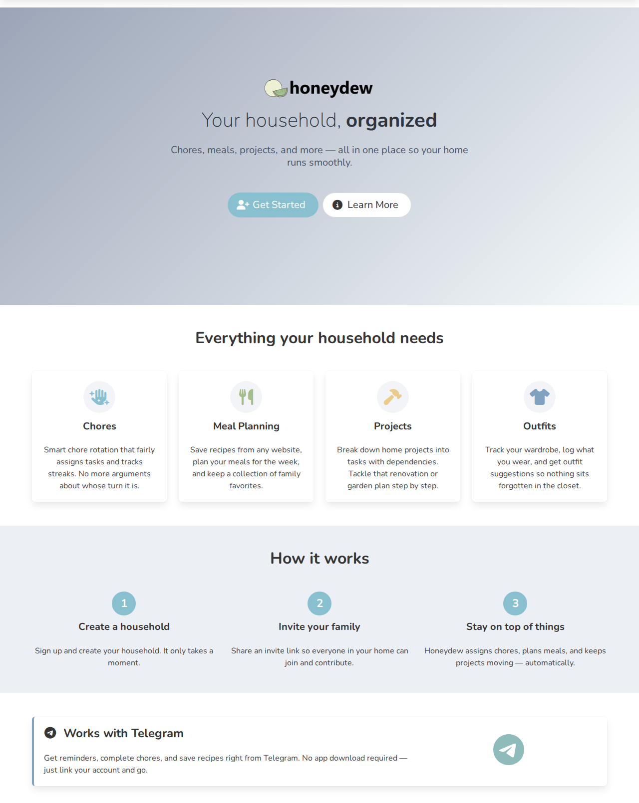

I spent way too much of my life avoiding having to make decisions and priorities.
My wife and I have a goal to "do one thing on the house every day".
This usually means fixing baseboard, painting, adjusting cabinet doors, installing new cabinets.
It ranges from small to big tasks and looking at the spreadsheet is very overwhelming.
So work tends to happen in spurts.

At the same time, cleaning and meal planning are two areas where I need to invest the mental effort to keep track of it and plan it out, but just haven't made a focused effort.
It's the stupid stuff like cleaning the dishwasher filter (which you should be doing), dusting ceiling fan, vacuuming out the tracks in the windows, and so on.
The list is nearly endless.

Rather than change my ways, let's do the person working in tech thing and throw technology at the problem and tell ourselves that it will solve it.

Presenting: __honeydew__

A small platform for managing house work, house cleaning, and meal planning.

This is not an advertisement to use my new platform.
In fact, don't.
I've been using it for four or five years now and have no intention of sharing it widely.
I break it frequently and don't want to be on the hook for it.

I'll talk about how I made it, why I'm talking about it now, and the outcomes.

## The Stack

The tech stack is actually almost entirely typescript (I really like it).

I looked into a few options for hosting but settled on Cloudflare pages.
I was seriously impressed by their deploy times and decent documentation.
Despite working on Azure in the past and having free credits, the deploy experience was terrible.
Nuxt, Astro, and Qwik were all evaluated but ultimately I went with Vue as it's what I know.
Perhaps in the future I'll swap it out.

There are two main ways to access this: the webapp and Telegram.
I'll cover each independently.

### Data Storage

I originally started with Cloudflare KV since their SQL database was still in private beta and I didn't want to bother my one friend at Cloudflare and ask for special treatment.
That meant waiting in line like everyone else.
I had a decent abstraction layer over the datastore, so when D1 finally became available, the migration was relatively painless.
Now I'm using Cloudflare D1 (their SQLite-based database) via Kysely as an ORM, with KV still handling caching, sessions, and things like magic link tokens.
All dates are stored as Julian Day Numbers, which makes date math dead simple — "how many days since this chore was last done?" is just subtraction.

### The Webapp

The frontend is Vue 3 with Pinia for state management and tRPC for type-safe API calls.
This means the frontend and backend are just magically in sync while sharing code.
It's styled with Bulma and a Nord color theme because I like blues and greens.

The webapp is where most of the UI side of things are.
You add chores with a name and a frequency (in days), and the system figures out who should do what and when.
There's a scoring algorithm that prioritizes the most overdue chores while penalizing ones that were recently assigned.
You can assign chores to specific people or leave them as "Anyone" for the auto-assigner to figure out.

I'm still not happy with the meal planning.
I tried to scrape the recipe using a chain of parsers — it tries site-specific scrapers first (America's Test Kitchen, EveryPlate, Joshua Weissman, etc.), then falls back to generic Schema.org JSON-LD parsing.
I had grand plans for automated meal plan generation but that's still a stub.
With the rise of agents, I would love to figure out some sort of smart meal planner that can look at local sales in my area and place a pickup order.

House projects are basically multi-step to-do lists with dependency tracking.
Each task can have up to two prerequisite tasks, and the system only surfaces tasks whose dependencies are complete.
This is what we use for the house renovation stuff — "install cabinet" depends on "buy cabinet" depends on "measure space".
Breaking house projects up into small tasks is not easy.

There's also a clothing inventory system that I added because why not.
You can track what's in your closet, how many times you've worn something since its last wash, and get outfit suggestions based on the weather.
That last part is still pretty rough.

Authentication is passwordless — you sign up with just a name and an optional household invite key, validated with a Cloudflare Turnstile captcha.
Sessions use JWT tokens stored as cookies.
If you need to log in from a new device, you generate a magic link (a 50-character random key with a 1-hour TTL) that you can access via the app or Telegram.
I started a recovery mechanism but couldn't be bothered to hook up an email.

### Telegram

The Telegram bot was going to be the killer feature.
I really thought getting a push notification with your chore for the day and being able to tap "Done" right there in the chat would move the needle.

Let me ask you a question: how effective are the notifications from duolingo or other apps?
For some people, they work amazingly (a friend recently showed me their ~2630 day streak).
For some, they actively hinder doing it.

Duolingo to their credit has published several research papers [such as this one](https://research.duolingo.com/papers/yancey.kdd20.pdf) about how to send a notification at the right time.
Rather than trying to implement their complex algorithm, I just added a streak system.

It somewhat helps but it hasn't been the boost I was hoping for.
Which I should have known, the streak in duolingo isn't that big of motivation for me.

## Why Talk About It Now?

One word: AI.

Suddenly, this goes from a hand rolled project to something that is flexible and moldable.
I can be at the park with my son and while he's swinging, I can send a quick message to claude "hey- can you please fix the chore assignment algorithm, I've been told to clean the bathroom mirrors for the last three days in a row. I'll do this weekend but I might do something else if asked", then go back to pushing him on the swing, checking the PR when I next have a free couple of minutes.

Whatever your feelings about AI and absentee parenting, I will freely admit that this has been a double edged sword.
It has sucked a lot of the enjoyment out of the project.
While I know the codebase enough to be able to accurately review the PRs, it isn't as fun as doing it myself.
On the other hand, keeping NPM packages working together is tedious and I don't want to do it.
Finding the time to sit down at the computer for an hour straight is very challenging.

I have some thoughts on how to make claude work for me when using mobile.
Things like github CI pipelines and pipelines that post screenshots so I can more easily see what the new features look like.
There have been a few changes where it just becomes too much for me to review on the phone screen.

It has become a personal tool that does whatever I want it to.
Want a clothing inventory and outfit recommendation system? Go for it.
No need for a separate app.

## Final Thoughts

The easier solution is to just have a monthly, quarterly, and yearly checklist.
Just decide this Sunday or Saturday is going to be checklist day.
Done.

It's what some people have done for years and it works fine.
Is it cool that I have a digital nag that is really obsessed with my personal situation?
Maybe.

Is it cool that I have a small ecosystem that I can use for whatever I see fit?
Absolutely.

Would I recommend building your own?
Probably not.
But if you're the kind of person who reads blog posts about household management systems built on Cloudflare, you were probably going to do it anyway.

