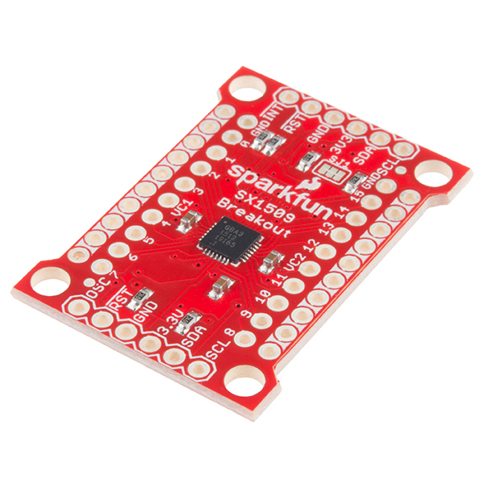
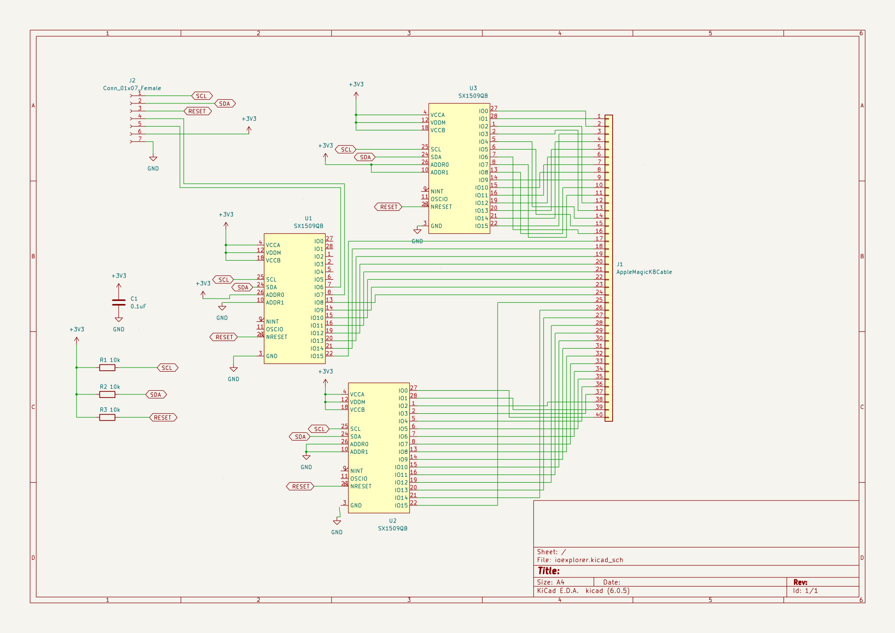
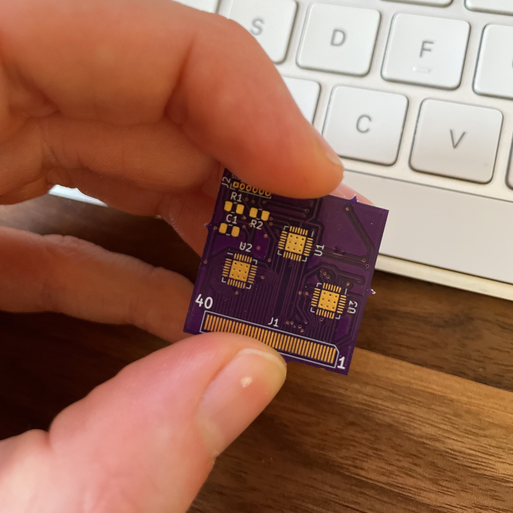

## The Build

Like many programmers/engineers/gamers, I've found that I just enjoy mechanical keyboards.

Maybe it's just the noise.

Maybe I like the ways the keys feel.

Maybe it's all in my head.
Either way, I prefer a mechanical keyboard and am willing to spend some dollars on it.
Does it make me a better typist?
I don't think so.
Does it allow me to type faster? I don't think so. The WPM tests I've done are too varied, even on the same keyboard. I have a 16" Intel MacBook Pro as my portable dev machine from work, and I use it closed in a dock. Unfortunately, this means that the fantastic Touch ID sensor on the MacBook's keyboard is unavailable for authenticating.
My Apple Watch takes care of a lot of things but not everything.
Particularly sudo authentication.

Apple makes a version of its keyboard known as the [Magic Keyboard with Touch ID](https://www.apple.com/shop/product/MK293LL/A/magic-keyboard-with-touch-id-for-mac-models-with-apple-silicon-us-english).
It has a Touch ID sensor in it and everything.
The only problem was that it's a flat chiclet-style keyboard, which I don't care for after using it for a bit.
It's not bad, it just isn't what I want.

Before we get further into this, I'll put this big old disclosure.

**I do work for Apple but do not work on keyboards or accessories**

**This represents my own work and opinion _and is _in _no__ way something_ that is endorsed/supported/affiliated with Apple*

After giving it some thought, I cannot release the schematic for the keyboard or connector.
I think just putting this write-up is a bit risky so it will focus on the process rather than the actual device itself.

Hopefully, that's enough legalese to cover my butt 🤞 :heart:

So here's the product of my labor:

It's gorgeous.

# Cracking Open The Keyboard

The first step was to crack open the keyboard. IFixIt has a [wonderful teardown guide](https://www.ifixit.com/Teardown/Magic+Keyboard+Teardown/50995) for previous magic keyboards.

Unfortunately, I couldn't find a video of a more recent teardown, so I was going in dark. (Editor note: I later found a great teardown that came out after I started working on this, it will be mentioned later).
The glue on the back was pretty substantial, and I'll admit it took me a while to think of using a hairdryer. But, with a little heat, it came off pretty quickly.

Inside, a combination of T3 and T4 screws held it together.
After 30ish screws, I had a logic board.
But I was dumb and wasn't paying attention to the fact that the battery cable when through the plate and ripped the battery connector right off.
They had a little window to unclip the battery connector (the thing with two little balls on it).

I panicked when the keyboard wouldn't respond after plugging it in (since the circuit expects the battery there).
A bit of research shows that the second-generation Magic Keyboard (the non-touchID one) shares a battery (A1645), and while you can buy the battery online from a sketchy site, I didn't want to pay $30. So using what I learned, I pulled that secondary keyboard apart in a much less destructive way. Unfortunately, the glue on the battery sucked, and I felt terrible slightly bending it, probably shorting its life.

The keyboard turned on just fine with the battery, and I had the logic board (seen below on the right). (Update: a battery isn't required, I'm not sure why it didn't turn on initially)

It has four connectors, the lighting port, the touch ID module, a ribbon cable to the main PCB, and the battery connector.

# Reverse Engineering

Now I needed to reverse-engineer the wiring.
The first step was to figure out the ribbon connector.
It's 40 pins and 0.5mm spacing (calipers are amazing).
So I measured a single pin, the distance of the whole pin length, divided by 39, and finally took a picture and did some pixel math.

They all pointed at 0.50mm for pin spacing.

The thickness is roughly 0.2mm but I'd throw a margin of up to .05mm since my Neiko calipers aren't the most expensive in the world (and I'm guessing small sizes don't help either).

I poked around Digikey and tried to find things that matched.
I didn't see many options I was confident about.
A socket might be out of the question.
For the first revision, I used some tape to press it against the contacts on the board.
For that, I used the [Sparkfun 16 Output I/O Expander](https://www.sparkfun.com/products/13601).

With three of these, I can pull 48 inputs (I need 40).
Then, with a little Arduino, I can print in the console to hold a specific key, and it scans every combination, trying to find the pair that connects them.
Then I can build up a matrix since I assumed it uses a scanning matrix.

Rather than get the Sparkfun board itself and have to wire up a rat's nest, since we're already ordering a PCB, let's put the SX1509 right onto the PCB.
I just wanted to shout out to Sparkfun as I stole their design and used it on my board.
Here's the schematic:

Version 1.0 had a fatal flaw; the reset line (inverted signal) was left floating rather than tied high.
So the board is always left high.
There's no trace to scrap and attach to, and the pitch is ridiculously tiny.
Three PCBs are $5 and two weeks of waiting, so I might as well fix it and send it out for version 1.1.
I really should have noticed it before I soldered it up. Luckily I ordered 6 SX1509 instead of the 3 I needed.

# Finding a connector

I ordered about 12 different connectors from Digikey (as mentioned earlier).

Unfortunately, none of them worked very well.

Around this time, [a youtube video](https://www.youtube.com/watch?time_continue=281&v=hz9Ek6fxX48&feature=emb_title) came out that took the touch ID module out of a keyboard.
So while it was in the same vein as what I was going for, I'm focused on using the keyboard controller board with the keys.

The tape holding down the FPC was unreliable, and connections tended to be flakey at best.
So I decided to do something more drastic and go down a layer.

# Complete teardown

I decided to teardown the keyboard to the little plastic that controls it all.
Unfortunately, the keyboard matrix is two sheets glued together with some extra bits thrown in between, so it's hard to measure continuity.
Other keyboards tend to be one or two sheets with traces on the outside rather than the inside.
So it looks like I'm back trying to probe from the connector side.

After some probing, I had a way to determine which column lines went to which row lines.

# Keyboard Layout

Whenever you design a mechanical keyboard, the layout of the keys deserves almost as much consideration as the actual construction itself.
A [great Hackaday article about making a low-profile keyboard](https://hackaday.com/2022/03/16/a-clear-guide-for-a-low-profile-bespoke-keyboard/) lists some great resources.

# Designing the PCB

Now that I had the logic board extracted and a plan, it was time to get to work designing a PCB.
I've traditionally used Eagle and Altium (when someone was willing to pay), but I decided to try [KiCad](https://www.kicad.org).
While I don't think I love it, as it has some clunkiness and I'm getting better at working around the quirks.
The 3d viewer in particular (now that I'm much better at blender)

# Ideas

Kailh Sockets
https://github.com/50an6xy06r6n/hotswap_pcb_generator
https://kbdfans.com/products/mechanical-keyboard-switches-kailh-pcb-socket
https://github.com/sszczep/Cherry-MX-Breakout-Board
https://github.com/daprice/keyswitches.pretty
https://github.com/colemarkham/keyboard_parts.pretty
https://github.com/ai03-2725/Type-C.pretty
https://github.com/ai03-2725/WS2812B.pretty

