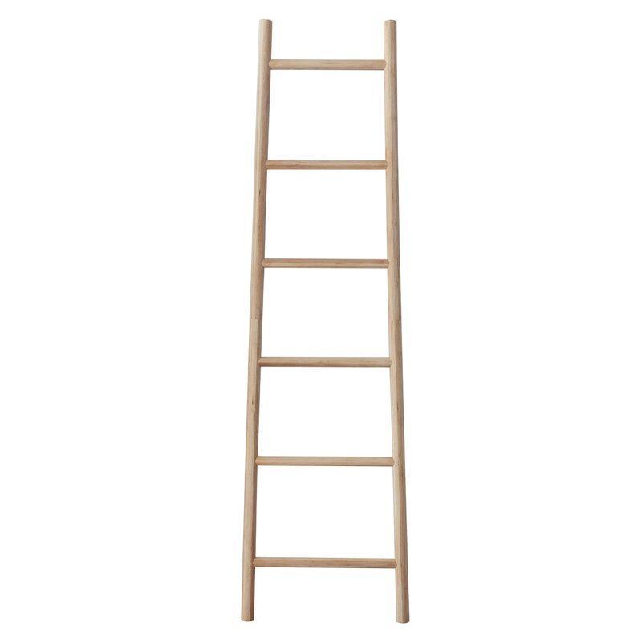
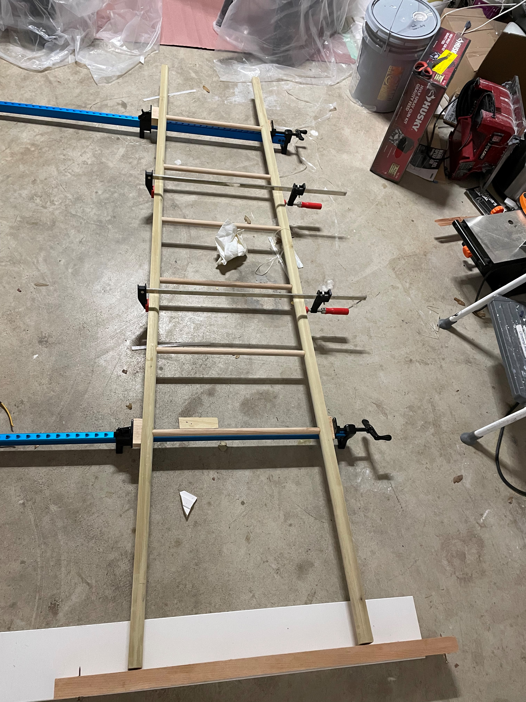
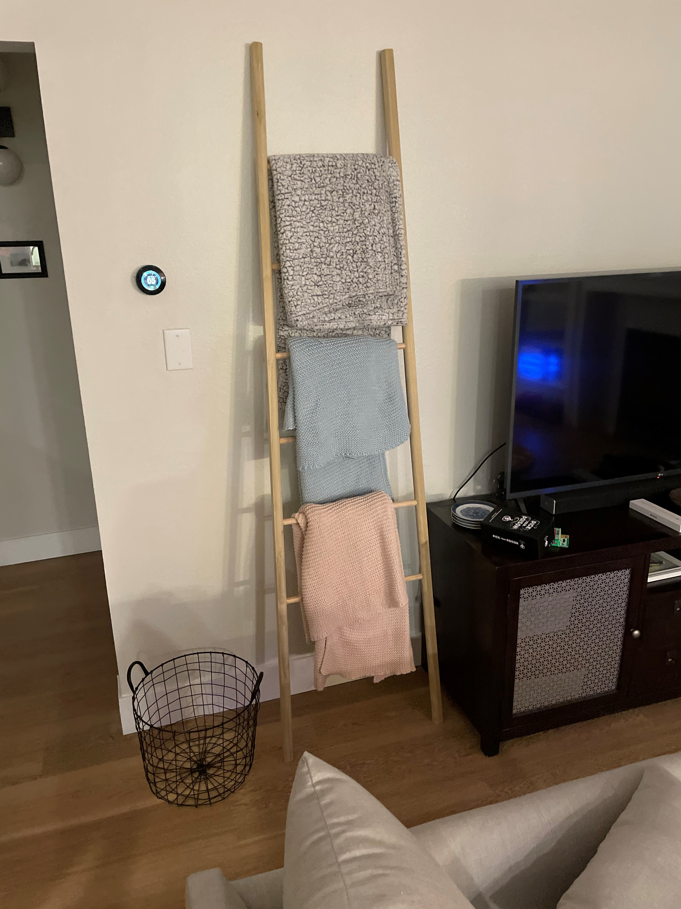

## Todo Graph

flowchart TD
  %% what's done %%
  classDef done fill:#9f6,stroke:#333,stroke-width:2px;
  %% items %%
  subgraph Shaping
    s_rungs("Cut Rungs"):::done
    s_rails("Cut Rails"):::done
    s_route_outside("Round Outside Rails"):::done
    s_route_inside("Round Inside Rails"):::done
  end
  subgraph Painting
    p_select["Select Paint Color"]
    p_prime("Prime Rails"):::done
    p_paint["Paint Rails"]
    p_sand["Sand Primer"]
    p_seal["Seal The Rungs"]
  end
  subgraph Assembly
    a_glue("Glue Rails and Rungs Together"):::done
    a_weights["Add weights to bottom"]
  end
  %% sequence %%
    s_rungs-->a_glue
    s_route_outside-->a_glue
    s_rails-->s_route_outside
    a_glue-->s_route_inside
    s_route_inside-->p_prime
    p_select-->p_paint
    p_prime-->p_sand
    p_sand-->p_paint
    p_paint-->p_seal
    p_seal-->a_weights


We recently moved and my wife had a request.
She wanted something tall to change the visual weight of the room.
I agreed with her (she has a vision and who am I to stand in her way?) and she sent me this:

It's a nice piece of furniture and solid wood.
The only problem is that it's 200$ USD and backordered for 4 months.
This article was written in early 2022 if you can't tell (hopefully you're reading this and supply chain issues are less of a worry).

I thought, how hard could that be to make myself?
Rockler sells some nice 1" (25mm) rods that I could buy and cut.
Except they only had one 1" rod but plenty of 3/4" (19mm) rods.
So 3/4" it was.
Looking back, I wish I had ordered/waited for the 1" ones as they would have looked better.
Strength wise, the 3/4" ones are just fine.

I found some old wood in the garage that was nice and long but only 3/4" thick.
I face jointed them and planed them until they were smooth enough to glue together.
After clamping them up, I ripped it down the middle to form two squares, each a little under 1.5" (38mm) thick.

Since my garage woodworking setup doesn't have a drill press (yet) I got out my square and did my best to just drill with my 3/4" bit with a piece of tape to mark the depth.
The holes weren't perfect but they worked alright. If I were to do this again, I'd invest in a drill press.

Cutting the rods involved a little math.
Using paint.net I was able to guess that the angle was around 2 degrees, so that's what I went for.
I measured the holes I drilled and then did some geometry.
Out of all the high school subjects I hated, geometry has been the most useful.
Though I hated the geometric proofs and have never needed them.

Since I wanted the outside rails to be round, I rounded the edges that the holes in them as I wouldn't be able to round them once it was glued up.
A massive 3/4" roundover bit did the trick but made a huge mess.
I left the outside edges not round as I wanted to have two nice flat surfaces for glue up.

Then it was time for glue up.
I cut little blocks at 2 degrees to make sure the angles were correct.
Getting it straight was also a challenge and I feel like it has a slight tilt to it
Next time I'll cut a 2 degree angle in a long piece of wood and have that as a reference edge in clamping on both sides.
I was adjusting as the glue dried and ran out of time as it got hard and harder to make small adjustments.

ß
After it dried it was time to test it against the wall.

The final step was rounding the two outside edges and finishing.
Since it was poplar on the outside, I wasn't sure how well it would take the stain.
I grabbed my test piece from earlier and wiped some stain on to see what it would look like.
I was debating painting it, but wanted to see what it would look it.

Ultimately I didn't love the look of the stained poplar and oak together, so I decided to go for a two toned approach with paint.

# Painting

I first sprayed it with some primer to get good adhesion.

