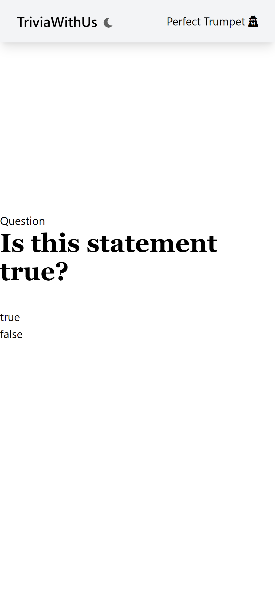

I've mentioned [Padgames](/projects/vuex-sync-p1) here on the blog before, but there's a common theme of creating games that everyone can gather around a central screen and play.
Jackbox games are a staple in my house for that reason.
I also was in college when Twitch Plays Pokemon reached its zennith.
Over the past few months a friend of mine and I had been talking about creating automated Youtube channels.
All these ideas sort of landed in my head and while isolating at home with a fever, these ideas seemed to merge in my head.
And so crowdtrivia was born.

In a nutshell, it is just a trivia game that is rendered and livestreamed to twitch and Youtube Live.
The code is all written to be fairly modular to allow different games.
Hopefully new games will be released soon.
The basic nutshell is that you try to guess what the preferences of the people you're playing with are on common, mundane topics.
Are you in line with the majority or are you good at guessing what people prefer?

It offers more replayability than trivia questions, what are of dubious quality, hard to source, and even harder to score.

So with that all out of the way, let's get into how I made it.

> Warning: this is a whole guide on how I made it and it is sort of long, so if you're looking for tl;dr, there isn't one.
> Maybe just go play?
> [Twitch](https://www.twitch.tv/triviawithus)
> [Youtube](https://www.youtube.com/channel/UCiyxADJJiPGzlCitixvoBvQ)
> [Website](https://triviawith.us)

## Getting a stream up

I had never streamed on anything before and digging into the documentation showed that RTMP seemed to be fairly prevalant.
There are plenty of simple servers on Github (and even a handy [full python one](https://github.com/KnugiHK/rtmplite3)).
But I didn't need a server, I needed a client to transmit to a server.
This was a long, dark rabbit hole with lots of spikes in the sides as you went down.
I don't love the solution I landed on, but I had set a goal of taking just a weekend to get it done in.

As far as I could tell from an hour or two of scanning through Github and Stackoverflow, most video livestreamed isn't rendered on a headless computer.
It is usually coming from a screencapture, camera, or a prerecordered source.
Looking back, I think I would have tried to write a traditional desktop app and then broadcast it.
I've seen some work that uses a display dongle to keep an x session alive.
Then you just point OBS at the openGL program.

FFMPEG offers some great options to stream from a file or camera straight to the RTMP endpoint.
Something like [v4l2loopback](https://github.com/umlaeute/v4l2loopback) fits the bill, which is a virtual camera.

At first I used an [rtsp-simple-server](https://github.com/aler9/rtsp-simple-server#standard) and streamed it to a VLC instance on my local dev box.
But after the initial concept was proven, I switched to Youtube's endpoint.

My test command ended up like this.

```
ffmpeg \
-f v4l2 -r 10 -i /dev/video0 \
-f lavfi -i anullsrc \
-c:v libx264 -pix_fmt yuvj420p -preset ultrafast -g 20 -b:v 2500k -x264-params keyint=48:min-keyint=48:scenecut=-1 \
-c:a aac -ar 44100 \
-vcodec libx264 -preset superfast -bufsize 960k -crf 28 -threads 2 \
-f flv rtmp://a.rtmp.youtube.com/live2/KEY_REDACTED
```

I just needed to write to the virtual camera.
I found [pyvirtualcam](https://github.com/letmaik/pyvirtualcam), which allows you to write straight to the virtual camera from python using numpy.
This allowed me quickly prototype the idea but I later revisited this.
Performance was quite good when writing to the screen each pixel each frame. But once I started rendering text with antialiasing, the performance tanked.
I pulled out the python and went straight for C++ as the bindings in pyvirtualcam were to a C++ ABI, so it wasn't a stretch to just adapt those to a C++ codebase.
Getting freetype2 and other goodies rendering to the screen was another hurdle to get over and I'm basically writing a graphics library that outputs to a memory buffer.
I suspect there's a library that does that or a way to get OpenGL to write to an array rather than window, but some of the options I looked at didn't really list this as a scenario.
Perhaps something to investigate in the future.

In the future, I could remove the virtual camera, write the image data directly to a stream and pump that into FFMPEG, but I found significantly less documentation on that.
The VM is on Azure (still have free credits) and it's just a small 2 core, 4GB machine and it still has plenty of overhead (running at around 30% on both cores and 700MB of used memory even when sending to two stream sources).

Getting v4l2loopback setup and figuring out why Youtube wasn't liking my stream (needs an audio component) or what the difference between yuv420p and yuvj420p all took time but I was happy to see it working.

## Getting the stream to two places

The next step was to take the stream to two places and here I cheated again.
I found [restreamer](https://github.com/datarhei/restreamer) which is a pretty handy piece of software.
It comes in a nice docker container and with an Apache 2 license.
Luckily, I had messed with docker on an earlier project and it ended up being pretty easy to configure.
With that up, I just pointed it at my virtual webcam (make sure to write frames to it) and I quickly had two streams up and going.

I still needed to test the overall latency of the stream though to figure out how to build the system.
It can be tricky as I might have to render the right answer while the server is showing the question for the first time (I'm thinking around 15-30 seconds of lag).

## Asking questions

There are now two pieces of this: the renderer and the web server.
The renderer pushes pixels to the virtual webcam.
The web server keeps track of the questions and takes answers from players.
The theme of this project is trying new things and I had watched an interesting video from fireship about [Solid.js](https://www.youtube.com/watch?v=hw3Bx5vxKl0&ab_channel=Fireship).
I thought about using solid.js and tinkered with it a bit but decided to go down the route I know: Vue.JS.
I love Vue.JS and generally dislike React (if you have a problem with this article, you're welcome to suggest a change, link at the top).
I borrowed the [vitesome](https://github.com/alvarosabu/vitesome) starter template and after creating a bit of an adapter so the websocket, api, and other stuff would still work whether I was using the express backend or the vite dev server, I had something decent.

I wrote a quick timed queue (basically it keeps track of how long things take), but more importantly, allows you to get what the current event is in a given time frame (peeking ahead for example).
For notifying clients, I just used socket.io.
I also made the renderer itself a client in socket.io just to make things simple.
There's a handy socket.io c++ client (though it uses BOOST).

In terms of reliability, I'll throw it onto an Azure webserver.
Plus, that's one less than that's based on something new.
I wanted to use the [bun runtime](https://bun.sh/), but after playing around with it a bit, it needs a bit more time in the oven.
Very much looking forward to it though.

I also used cloudflare as a CDN to keep the load on the small azure webservice down.
If this explodes in popularity, I'll need to setup a load balancer and have azure scale it up and down.
The architecture is designed to make use of a redis sub/pub system to sychronize the servers, so we'll cross that bridge when we get to it.

We're going to need a database and keep track of users so we can show a leaderboard and whatnot.
I hate the idea of collecting emails or passwords or the like.
So accounts will be tied to a specific device and you can change your display name, but that's about it.
There will be no passwords.
Basically a private key is generated on a device and you can transfer your account to a new device with a magic code.
By design, the server will only keep track of one public key at a time.
So when you transfer your account, the previous account will sign out.

It was rough and neded tweaking but I now had a website users could go to and answer the questions.

I'll admit in the picture it's a little hard to tell that you can click on true or false.

## Getting good questions

There's an online database of trivia questions known as [opentriviadb](https://opentdb.com/) which is what I started with.
But I noticed that it was of varying quality, with many video game related trivia questions.

Additionally, it was only 4000ish questions.
At 10 questions every 5 minutes or so, I would run through them all every day.
I also felt bad requesting every questions from their database on a daily basis.
There is an [amazing database of Jeopardy questions](https://j-archive.com/) run by some very decicated people.
They specifically request not scraping the data, republishing it, or monetizing it.

Several datasets already exist on kaggle and tensorflow, but just because your friends are breaking the TOS, doesn't mean you need to too.

I decided to do the wrong thing (I know, very shameful) and use the J-Archive dataset.
It has hundreds of thousands of questions and answers.
However, there was one glaring problem with it: Jeopardy questions are not multiple choice.

In some ways, I think it would be harder to have users write in their answer as opposed to clicking a choice.
Not in terms of UI, but the UX would be worse and grading an answer would be frustrating.
For example here's a recent final jeopardy:

```
Q: Over the end credits of "Confessions of a Dangerous Mind" she sings "There's No Business Like Show Business"
A: Rosemary Clooney
```

What are acceptable answers?
Should I accept anything with Clooney or Rosemary?
What if someone says Mary Clooney? Or Rosemary Clowney?
Would George Clooney be accepted?

It opens a whole can of worms.

So like any good engineer, I turned to more computers to solve my problems.
Using GPT-2, I fine-tuned it to complete questions.

```
Category: SCIENCE
Clue: Days & nights are always 12 hours long there
Answer: the equator
```

I tried a few different models (GPT-3 over on Hugging Face) and decided to stick with the medium/small sized Neo GPT-2 since that's what I can fit on my GPU.
(Yes I know, Google collab is a thing but my main issue with training is running out of VRAM and their 16GB of VRAM isn't that much bigger than my 12GB, if anyone knows of a resource that can fine tune a medium or larger GPT like model *for free* let me know).

The results were somewhat promising.
I generated completions at various tempatures, extracted the answer, and put them into a set for uniqueness.

```
Category: SCIENCE
Clue: This noble gas glows orange-red when an electric current is passed through it
Answer: ides,propane,chlorine,lithium,iced tea,hydrogen dioxide,iced water,mercury,vernite,octane
Correct answer: Neon

Clue: About 80% of this Mediterranean island's 700,000 people speak Greek; about 18% speak Turkish
Answer: Sicily,Cyprus,Rhodesia,Nicaea,Crete,Malta,Bali island,Sicilia,Rhodes
Correct Answer: Cyprus
```

While I love the idea of passing a current through iced tea, some of these are what close to candidates and some are not.
You might noticed some questions have the answer in them.
There needs to be some filtering as a secondary pass to make sure none of the answers are too similar.
I also need a way to figure out if an answer is plausible or not.
Perhaps some sort of word2vec score to the answer?
Or a way to weed out phrases that don't make any sense.

We'll get there when we get there.
For now, these seem pretty decent.

## Keeping track of information

I needed some way to keep track of what score a user has and what their username is, etc.
A SQL database isn't sexy but it's low fuss and considering how little I'll be storing in it, I'm not too worried about it.

## Rendering questions

I had mentioned that there was a socket.io C++ library but getting the stream to display the questions was a significant amount of work.
To receive information, render text, while still pushing pxiels entirely on the CPU I turned to having a few threads.
One thread as a compositor, one thread as a renderer, and one thread as a messenger.

Renderer is a bit confusing, as it render resources like images and text to buffers that the compositor can use.

## Step 8: Going Further

You could take this a lot farther.
I'm curious to experiement with large scale crowd games.
What happens to a game of life when there are 10,000s of players instead of 6?

Frankly, I don't know.

But I'm looking forward to finding out.

