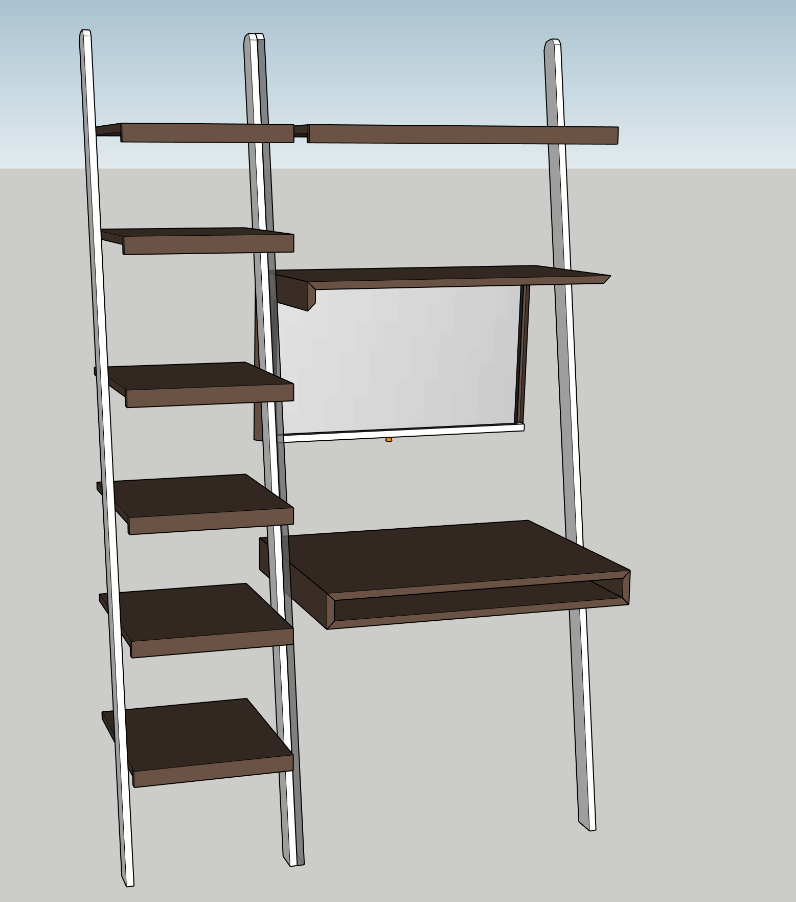
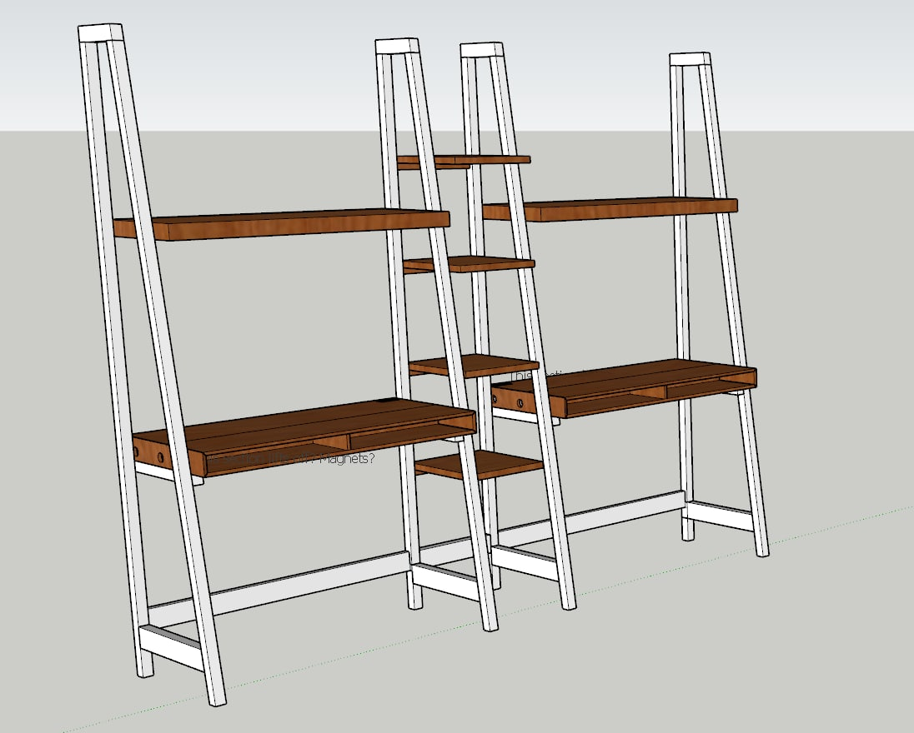
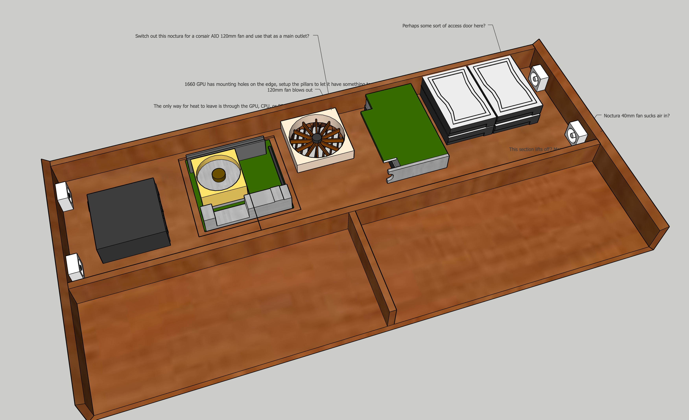
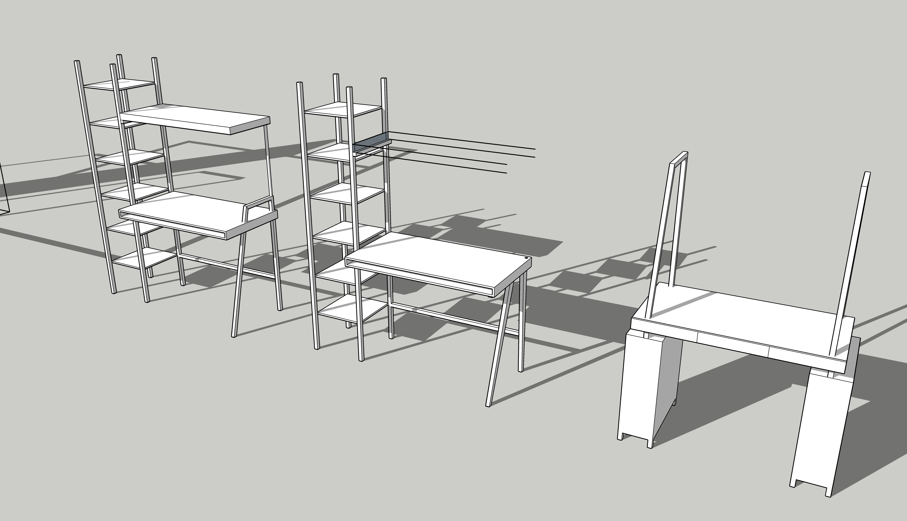
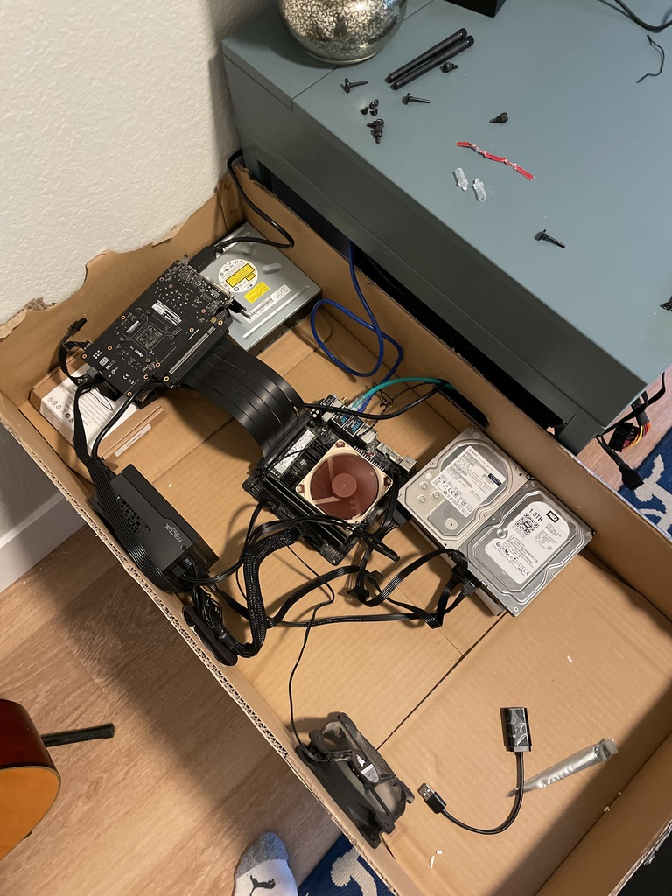
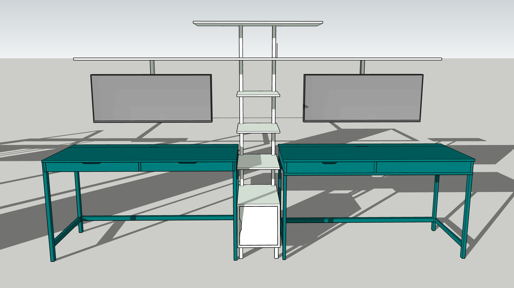
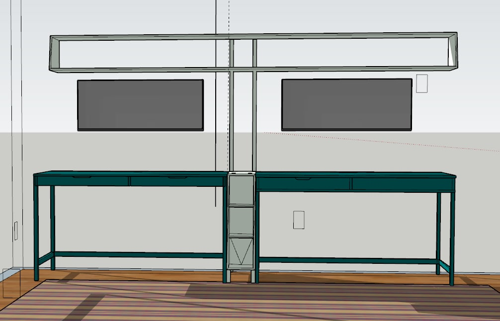
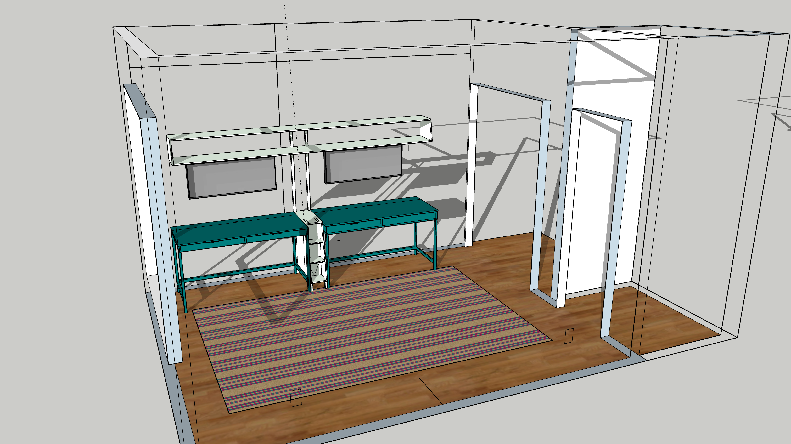
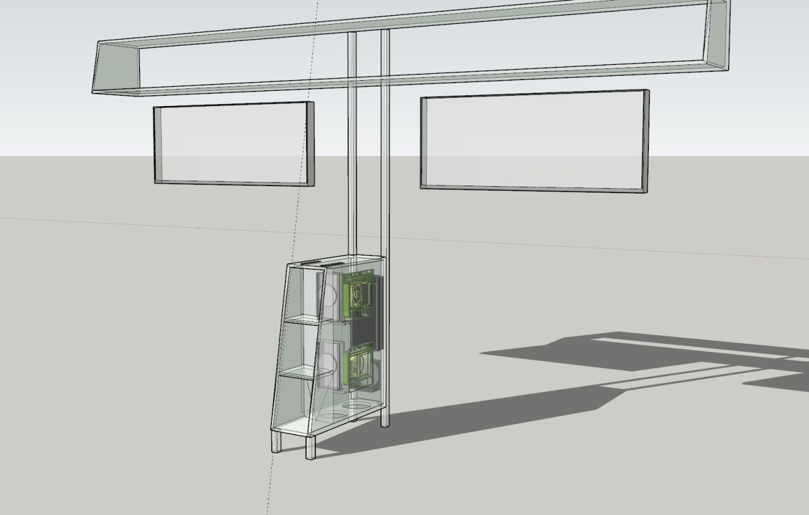
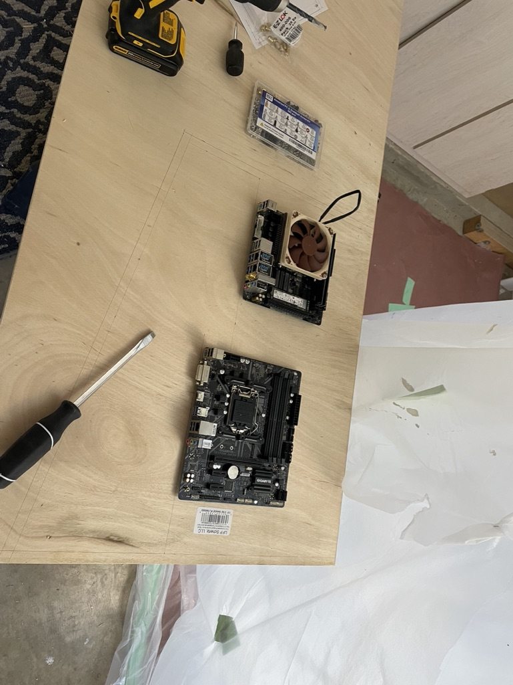

I work on computers. Not in the abstract, "they're in the cloud" sense but in the more literally I often have a large stack of them on my desk.
I think at one point I had around 10ish machines at my desk or in drawers.
This means that my desk in the office has sprawling tentacles of wires snaking out across the room. There are multiple power strips to power multiple desktops.
Various ethernet cords to give hardwired connections to machines that I frequently wipe and don't want to bother typing in my wifi password into.
It's a big mess.
My wife hates looking at the wires.

And I agree with her.

I spend 8+ hours in that room most days, so I wanted to create a desk so sleek that you didn't know that it had a computer in/on it.
All the wires would be contained within the desk.
It would finally bring the needed visual grace that our home office needed.

# The Finished Product

I believe in a good journey, but I know some of y'all are impatient, so here's the finished product:

# First Attempt

Inspired by the [invisible PC that DIY Perk built](https://www.youtube.com/watch?v=Perqf0dOGLk) I jumped into Sketchup and whipped out a first attempt.

It was inspired by ladder desks that you see on Pintrest and wanted shelves.
The plan was to fit the PC in about 3" using a PCIe riser cable and for the monitor to flip down in that upper shelf with a false drawer front hiding the fact that it was too thick for an upper shelf. Wires for power and display ran up that middle section, which I've colored so you can see it is actually two pieces of wood glued together with a channel routed in the middle.

The design wasn't getting the wife's stamp of approval, so it was back to the Sketchup board.
Some of the feedback I received:

- the visual weight is all wrong
- why don't I get a cool desk?
- why even hide the monitor, how often do you sit at a desk to do things other than do computer stuff?

We had also moved during this time and the new office could support two desks on the same wall, which opened new possibilities.

# Attempt Two

The next attempt took the concept and added a second desk and a bit more heft to it.

The idea was expanded to have ultrawides instead of a large 32" monitor. 
They aren't flipped down in this model but they're in there.
The desks were made wider and given a flap on the top that can lift up for easy access to the computer parts inside.
Here's a view inside so you can see how the parts were laid out:

Still, the wife wasn't as happy with it, so I continued to iterate.
I did a few designs but wasn't really happy with any of them.

# Attempt Three

While I was iterating, some shifts had happened in the office.
My wife's crappy old desk fell apart and she needed a new one.
There's an IKEA just up the road and the really cheap IKEA desk she had before had lasted several years, so I agreed that we could go look.
My intention was that it would be replaced by whatever I built.

That was my intention anyway.

Ellen found a really cool desk in a beautiful color that she was really excited about.
It had metal legs and had a very attractive price tag.
What I didn't expect was for her to like it so much.

So the next design built around "how do I let her keep her desk" and still accomplish what I was going for.
The first thought was to modify the IKEA desk to make it hold a PC but the dimensions just were tricky to make work.

I build a cardboard prototype to sort of mock-up what the existing design was.

Even that was tight heightwise and there wasn't any way I was going to fit it into something half the width.

I pivoted to what I dubbed the **Hidden Dual PC Tower**
The idea was instead of putting the computers in the desk, they go in a little tower between the computers with the monitors attached.

That little section down there needed to contain two mITX motherboards, cooling, and power supplies.
The initial calculations on space and heat dissipation weren't promising so it needed to expand in space.

That led to version 4.

# Attempt Four

It became a good bit thinner as they could be stacked on top of each other and the section that holds the monitors became a good bit stronger.
The two long rods in the back are square aluminum tubing since some back of the envelope math shows it's strong enough for my usage and I can route cables through it.
Plus since it's aluminum I can cut it on my miter saw and I don't need to get out the grinder.

Here's a view of it in the office so you can get a sense of scale.

Here's an inside view of the middle console so you can see the components start to be laid out.

The black thing at the back is an AOC cooler and the circles at the bottom are intakes.
Even with the added height, it's tight.

# From 3d Model to Wood

1/2" sanded plywood is pretty cheap and since it's just going to get painted, I'm not too worried about the wood, just that it's flat and easy to work with.
I draw the outside wall out on the wood and added the standoffs.

**TBC**

