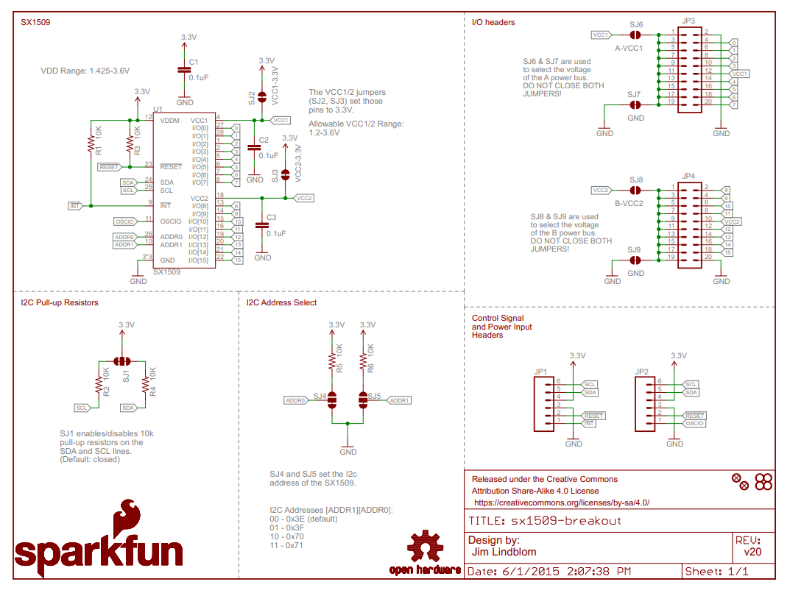

## Todo Graph


flowchart TD
  %% what's done %%
  classDef done fill:#9f6,stroke:#333,stroke-width:2px;
  %% items %% 
  disassemble["Take Keyboard apart and extract logic board"]:::done
  reverse_engineer["Reverse engineer the circuit from the flex cable"]
  design_keyboard["Design a PCB that can accommodate the magic keyboard PCB"]
  build_pcb["Fab and assemble the PCB"]
  %% sequence %%
    disassemble-->reverse_engineer
    reverse_engineer-->design_keyboard
    design_keyboard-->build_pcb


## The Build

Like many programmers/engineers/gamers, I've found that I just enjoy mechanical keyboards.

Maybe it's just the noise.

Maybe I just like the ways the keys feel.

Maybe it's all in my head.

Either way, I prefer a mechanical keyboard and I am willing to spend some number of dollars on it.
Does it make me a better typist?
I don't think so.
Does it allow me to type faster?
Don't think so. The WPM tests I've done are too varied even on the same keyboard.

I have a 16" Intel Macbook Pro as my portable dev machine from work and I use it closed in a dock.
This means that the fantastic Touch ID sensor on the Macbook's keyboard is unavailable for authenticating.
My Apple Watch takes care of a lot of things but not everything.
Particularly sudo authentication.

Apple makes a version of it's keyboard known as the [Magic Keyboard with Touch ID](https://www.apple.com/shop/product/MK293LL/A/magic-keyboard-with-touch-id-for-mac-models-with-apple-silicon-us-english).
It has a Touch ID sensor in it and everything.
There's only one problem was that it's a flat chiclet style keyboard, which after using for a bit I just don't care for.
It's for some people, but not for me.

Before we get too much farther into this, I'll put this big old disclosure in there.

**I do work for Apple but I do not have access to schematics for keyboards nor work on peripherals**

**This represents my own work and opinion and is no way something that is endorsed/supported/affiliated with Apple**

Hopefully that's enough of legalese to cover my butt 🤞 :heart:

So here's the product of my labors:

It's gorgeous.

# Cracking Open The Keyboard

First step was to crack open the keyboard.
IFixIt has a [wonderful teardown guide](https://www.ifixit.com/Teardown/Magic+Keyboard+Teardown/50995) for previous magic keyboards.
I wasn't able to find a video of a more recent teardown, so I was going in pretty dark.

The glue on the back was pretty substanital and I'll admit it took me a while to think of using a hairdryer.
With a little bit of heat, it came off pretty easily.
Inside a combination of T3 and T4 screws held it together.
After 30ish screws, I had a logic board.
But I was dumb and wasn't paying attention to the fact that the battery cable when through the plate and ripped the battery connector right off.
They had a little window to unclip the battery connector (the thing with two little balls on it).

So I had a moment of panic when the keyboard wouldn't respond after plugging it in (since the circuit expects the battery in there).
A bit of research shows that the second generation Magic Keyboard (the non touchID one) shares a battery (A1645) and while you can buy the battery online from a sketchy site, I didn't want to pay $30.
So using what I learned, I pulled that secondary keyboard apart in a much more no destructive way.
The glue on the battery sucked and I felt bad bending the battery slightly, probably shorting its life.

With the battery in, the keyboard came up just fine and I had the logic board (seen below in the right).

It has four connectors, the lighting port, the touch ID module, a ribbon cable to the main pcb, and the battery connector.

# Reverse Engineering

Now I needed to reverse engineer the wiring.
First step was to figure out the ribbon connector.
It's 40 pins and 0.5mm spacing (calipers are amazing).
I measured a single pin, the distance of the whole pin length and divided by 39, and finally took a picture and did some pixel math.

They all pointed at 50mm.

The thickness is roughly 0.2mm I'd throw a margin of up to .1mm since my Neiko calipers aren't the most expensive in the world (and I'm guessing small sizes don't help either).

I poked around Digikey and tried to find things that matched. 
I only found 5 options.
I ordered one of each and designed a little PCB that accepted each of the footprints and ordered 5 copies. 
This will allow me to probe the circuit board more deeply.

For that I used the [Sparkfun 16 Output I/O Expander](https://www.sparkfun.com/products/13601).

With three of these, I can pull 48 inputs.
With a little ardunio, I can print in the console to hold a specific key and it scans every combination trying to find the pair that connects them.
From there we can build up a matrix since I'm assuming it uses a scanning matrix.

Rather than get the sparkfun board itself and have to wire up a rats nest, since we're already ordering a PCB, let's put the SX1509 right onto the PCB.
I just wanted to shout out to sparkfun as I stole their design and used it on my board.
Here's the schematic:

The board files are up on Github. TODO: add link to github files after the repo is public.

# Keyboard Layout

Concurrently I had to start thinking about how I wanted the keys to be laid out.
There's a [great hackaday article about making a low-profile keyboard](https://hackaday.com/2022/03/16/a-clear-guide-for-a-low-profile-bespoke-keyboard/) that lists some great resources.

# Designing the PCB

Now that I had the logic board extracted and a plan, it was time to get to work designing a PCB.
I've traditionally used Eagle and Altium (when someone was willing to pay for it) but I decided to give [KiCad](https://www.kicad.org) a try.
The 3d viewer in particular (now that I'm much better at blender)

# Ideas

Kailh Sockets
https://github.com/50an6xy06r6n/hotswap_pcb_generator
https://kbdfans.com/products/mechanical-keyboard-switches-kailh-pcb-socket
https://github.com/sszczep/Cherry-MX-Breakout-Board
https://github.com/daprice/keyswitches.pretty
https://github.com/colemarkham/keyboard_parts.pretty
https://github.com/ai03-2725/Type-C.pretty
https://github.com/ai03-2725/WS2812B.pretty

