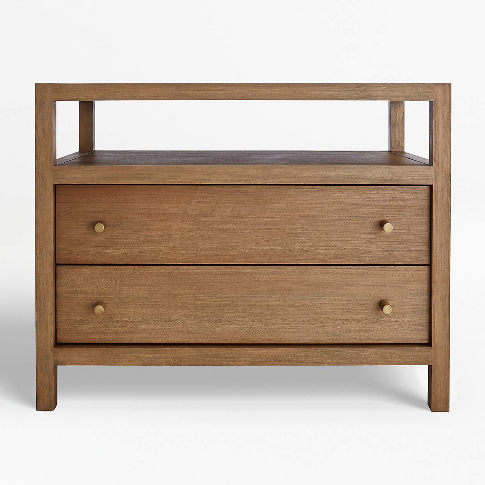
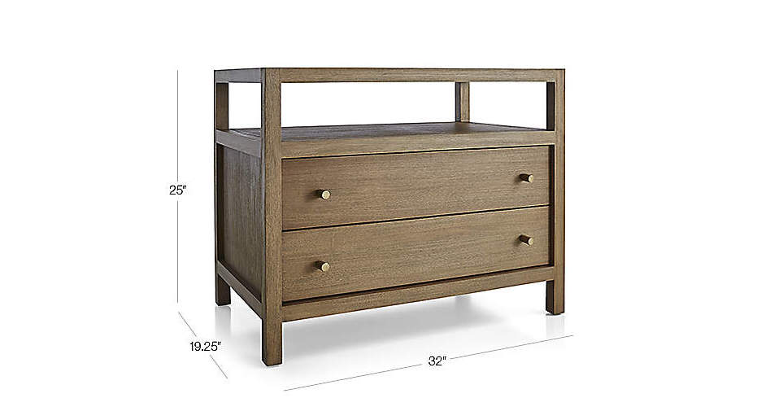
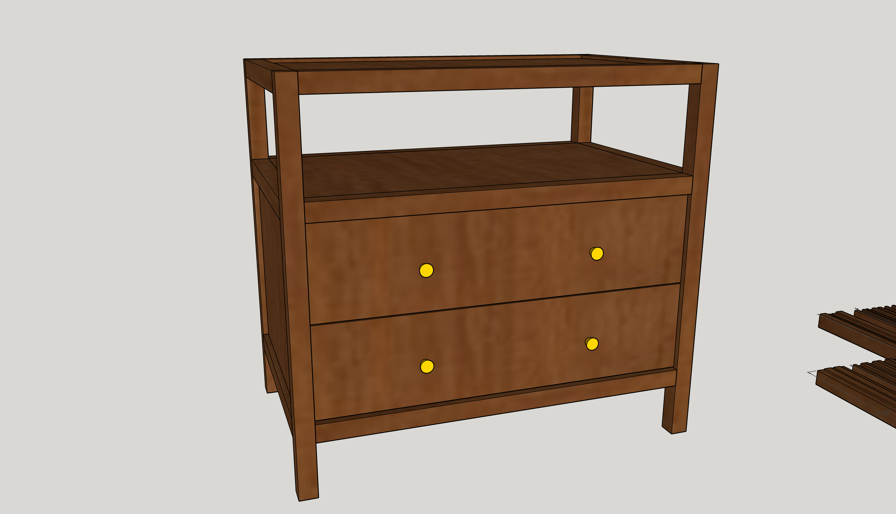
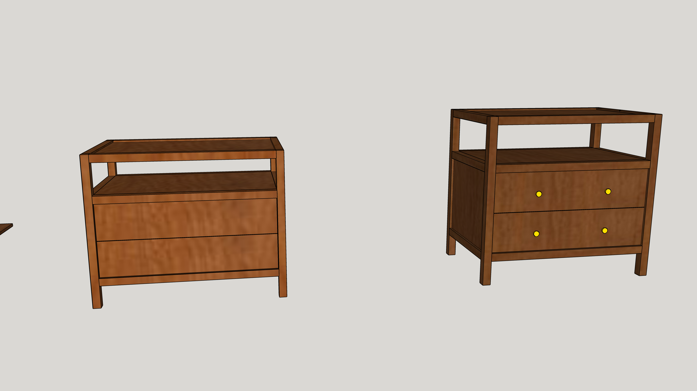

My wife found these nightstands from a popular furniture place.

They're fairly standard with regular measurements.

There's only one problem.
They're over **500$** USD.

Each.

In typical husband fashion, I exclaimed that I could do that for a fraction of the cost.
Even using the same solid mahogany.
It sort of kicked off my woodworking journey.

So let's begin where it usually begins: sketchup.

# Sketchup

I first started recreating it from the photo with some golden ratio measurements thrown in whenever it wasn't clear.

I came up with something like this:

You'll notice the proportions are a little different. I designed it to fit in a 2'x8' piece of plywood so you could make two from a single sheet of 4'x'8'. 

I bought some real 6/4ths mahogany and then moved.
Then I got scared of ruining my somewhat expensive (at the time it seemed expensive but looking back I got a great deal on it).

I then designed a smaller version as a test version to make out of cheaper wood (pine or poplar). 

The idea was to get comfortable with the dowels and other tools I had.
I did woodshop in high school and had watched a many hours of youtube. 
But experience 10 years ago and lots of video watching does not an expert make.

# Smaller prototype
